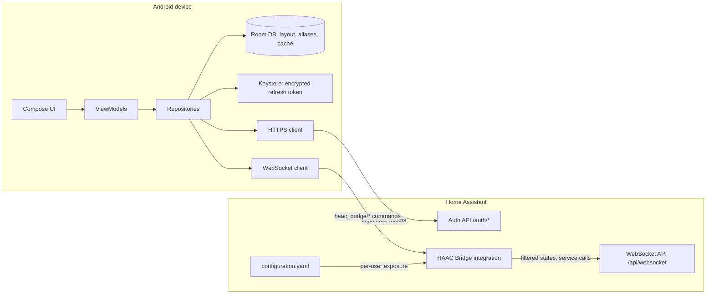
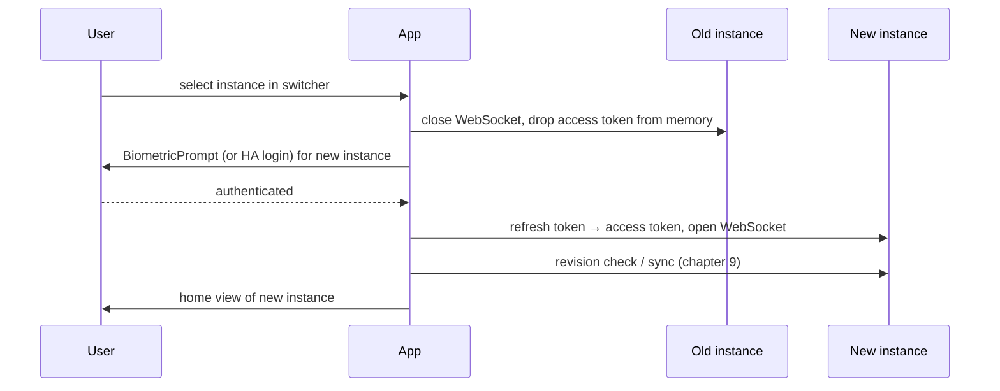
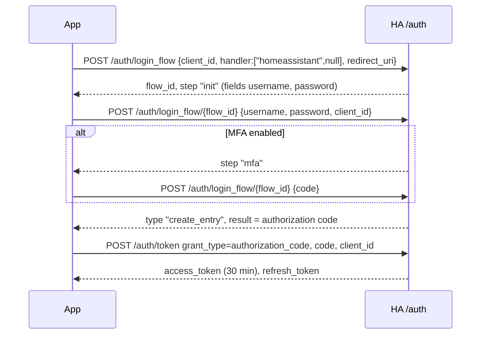
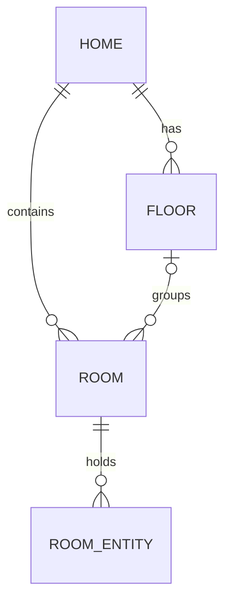

# HA Android Client (HAAC) – Technical Concept

Status: 2026-09-27 · Author: Anton Graichen-Hartl

## 1. Introduction and scope

The solution consists of a native Android app and a companion Home Assistant (HA) custom integration distributed via HACS. Together they let a HA user organise selected entities into their own homes, floors and rooms on the phone and control them with the same functionality HA offers.

Product name of the app: **HA Android Client**, short form **HAAC**. The companion Home Assistant integration is **HAAC Bridge** (integration domain `haac_bridge`, repository `stacknoise/haac-bridge`).

### 1.1 Goals

- Connect the app to one or more reachable HA instances by entering their server URLs, and switch between them at any time.
- Log in with the user's existing HA account; afterwards unlock via fingerprint.
- Never store plaintext passwords – not in code, not in any database, not in preferences.
- Let the user model homes, floors and rooms locally and change that structure at any time.
- Load only entities the HA administrator has exposed to that specific user via `configuration.yaml`.
- Assign exposed entities to rooms, remove them again and give them local display names.
- Detect newly exposed and withdrawn entities on every app start.

### 1.2 Scope of version 1

| Area | In scope (v1) | Out of scope (later) |
| --- | --- | --- |
| Entity domains | `switch`, `sensor`, `climate` | `light`, `cover`, `binary_sensor`, `media_player`, `lock`, … |
| HA instances | Several instances, one active at a time, switch at any time | Entities of several instances combined in one view |
| Login | HA username/password (incl. MFA) per instance, fingerprint unlock | Passkeys |
| Structure | Home → Floor → Room, Home → Room (per instance) | Sharing layouts between devices/users |
| Storage | Local on the device | Cloud backup of the layout |
| Entity exposure | Per HA user via YAML | Config flow / UI in HA |
| Time-controlled actions | Schedules for switches: fixed time with weekdays, sunrise/sunset with offset; run on the server (chapter 19) | Climate actions, one-off dates, conditions, push notifications |
| Demo mode | A built-in demo instance with sample data, no server needed (chapter 20) | A hosted demo server, a guided tour |

### 1.3 Assumptions

- HA Core 2026.9.0 or newer; this is the minimum version of HAAC Bridge, declared in hacs.json and manifest.json; the integration targets the latest stable HA Python version.
- The HA instance is reachable from the phone via LAN, VPN, reverse proxy or Nabu Casa remote URL.
- One app installation can hold several HA instances, each bound to exactly one HA user; exactly one instance is active at a time.

## 2. System overview

Three components work together: the Android app, the HAAC Bridge integration running inside HA, and HA Core itself. The app talks to HA over HTTPS (authentication, token refresh) and a single persistent WebSocket connection (entity data, state updates, service calls).



| Component | Responsibility | Technology |
| --- | --- | --- |
| Android app | UI, local layout (homes/floors/rooms), aliases, secure token storage, biometric unlock, sync | Kotlin, Jetpack Compose, Room, Android Keystore |
| HAAC Bridge (HACS) | Reads per-user exposure from YAML, resolves the calling HA user, returns only exposed entities, pushes filtered state changes, validates service calls, stores and runs the users' schedules (19) | Python custom integration (`custom_components/haac_bridge`) |
| HA Core | User accounts, authentication, tokens, entity states, services, history | Stock Home Assistant |

The layout (homes, floors, rooms, room assignments, aliases) lives only on the device. HA is the single source of truth for entity states and for which entities a user may see.

## 3. Android app architecture and technology stack

The app follows Google's recommended layered architecture (UI → domain → data) with unidirectional data flow and a single-activity Compose UI.

### 3.1 Layers

- **UI layer** – Jetpack Compose screens, one `ViewModel` per screen, immutable `UiState` exposed as `StateFlow`.
- **Domain layer** – use cases such as `LoginUseCase`, `SyncExposedEntitiesUseCase`, `AssignEntityToRoomUseCase`, `CallEntityServiceUseCase`.
- **Data layer** – repositories (`AuthRepository`, `LayoutRepository`, `EntityRepository`) combining the Room database, the secure token store and the HA network clients.

### 3.2 Modules

| Gradle module | Content |
| --- | --- |
| `:app` | Activity, navigation graph, DI setup |
| `:core:security` | Keystore key handling, token encryption, biometric helper |
| `:core:network` | HTTPS client, WebSocket client, HA message models, reconnect logic |
| `:core:database` | Room entities, DAOs, migrations |
| `:feature:onboarding` | Server URL entry, login |
| `:feature:layout` | Homes, floors, rooms editor |
| `:feature:entities` | Entity picker, room view, entity detail/control screens |
| `:feature:settings` | Instances (add, switch, edit, remove), account, security (fingerprint unlock on/off), logout, diagnostics |
| :core:common | Shared helpers used by several topics (17.1, 17.6) |
| :core:error | ErrorCode, HaacException hierarchy, ErrorFactory, ErrorReporter (17.3) |
| :feature:instance | Instance list, switching, add and remove instances (4.4) |
| :feature:notifications | Notification list with entity changes and errors (9, 17.4) |
| :feature:schedules | Schedule list, detail, editor, time sheet, entity picker, admin views (19.7) |

Package names, the factory pattern, error codes and the code index follow chapter 17.

### 3.3 Technology stack

| Concern | Choice |
| --- | --- |
| Language | Kotlin (latest stable), coroutines and Flow |
| UI | Jetpack Compose, Material 3, Navigation Compose |
| DI | Hilt |
| Persistence | Room (SQLite) for layout and cache; typed DataStore (JSON via kotlinx.serialization) for non-sensitive settings |
| Networking | OkHttp (HTTPS + WebSocket), kotlinx.serialization for JSON |
| Security | Android Keystore, AndroidX Biometric (`BiometricPrompt`), Google Tink for AEAD where needed |
| Background work | WorkManager (optional periodic re-sync) |
| Testing | JUnit 5, Turbine, MockK, MockWebServer, Compose UI tests |

- **minSdk 28** (Android 9) – reliable `BiometricPrompt` and StrongBox support; **targetSdk** = latest stable API level required by Google Play.
- `androidx.security:security-crypto` (EncryptedSharedPreferences) is deprecated and is **not** used; encryption is done directly with Keystore keys (see chapter 5).

## 4. Onboarding and server connection

On first start – or whenever no server is bound – the app shows the server screen; with a bound server and valid session it goes straight to unlock or the home view.

### 4.1 Start routing

| Condition at app start | Target screen |
| --- | --- |
| No instance configured | Server URL entry (with *Try the demo*, chapter 20) |
| Last active instance has no refresh token | HA login for that instance |
| Last active instance: token stored, biometric unlock enabled | Biometric prompt |
| Last active instance: token stored, biometric unlock disabled | Opens directly; the stored token is usable only while the device is unlocked |
| Unlocked | Sync of the active instance (chapter 9), then its home view |

### 4.2 Server URL entry

**LAN discovery (M-01).** While the server screen is open, the app browses the local network via Android `NsdManager` for the service `_home-assistant._tcp`, which HA announces over zeroconf. Found servers are listed with host name and `IP:port`; the TXT record supplies base URL and HA version. If nothing is found, manual entry (*Other address…*) is always available. With targetSdk 36 neither discovery nor connections to local addresses need a runtime permission. From targetSdk 37 on, Android blocks all local network traffic by default; the app then requests `ACCESS_LOCAL_NETWORK` when the server screen opens and before the first home network check of an instance with an internal address (4.5). The `NsdManager` system picker (`DiscoveryRequest.FLAG_SHOW_PICKER`) is not enough, because it grants access to the chosen server only and not to the repeated discovery of 4.5. Without the permission, discovery and internal addresses are skipped and the app uses the external address. As built (targetSdk 37): `LocalNetworkAccess` (`:core:network`) reports the permission; `NsdServerDiscovery` ends at once and `DefaultEndpointSelector` skips the internal address without it. The app asks once when the *Add instance* screen opens and when the main area opens for an instance that has an internal address, and tries the connection again after the answer. Android versions before 37 never block local traffic and count as granted.

1. User enters a URL, e.g. `https://ha.example.com` or `http://192.168.1.10:8123`.
2. The app normalises it: adds `https://` if no scheme is given, removes trailing slashes and paths such as `/lovelace`.
3. Validation request `GET <url>/auth/providers`: a JSON list of auth providers confirms a HA instance and tells the app whether the `homeassistant` (username/password) provider is enabled.
4. Check that the HAAC Bridge integration is installed: after login, the WebSocket command `haac_bridge/info` must succeed (see chapter 11). If not, show an install hint with the HACS repository link. The instance is stored only after a successful check; until then the new tokens stay in memory, so *Try again* repeats the check without a new login, and *Start over* revokes them.
5. Duplicate check (4.5): if an instance with the same `instance_id` and the same HA user already exists, the address is offered as an additional address of that instance instead of creating a new one.
6. The instance ID and the addresses are stored in the `server` table (chapter 12): the entered URL, plus the internal and external address `haac_bridge/info` reports for the slot that is still empty (4.5). Addresses are not sensitive and not encrypted.

### 4.3 Transport security

- **HTTPS is the default.** Plain `http://` is only accepted for private addresses (RFC 1918, loopback, link-local, IPv6 unique/link-local, `.local`) after an explicit warning dialog. Android's network security config cannot express address ranges and OkHttp refuses cleartext entirely when the config forbids it, so the config permits cleartext and the rule is enforced in code (`CleartextPolicy`) before every request; public hosts over `http://` fail with `HAAC-NET-006`.
- Self-signed certificates: the user can trust the certificate on first use (TOFU). The app then pins its SHA-256 public-key hash for that address and shows the fingerprint for manual comparison. A later certificate change triggers a blocking warning. Each address of an instance (4.5) has its own pin.

**As built (TOFU)** – one OkHttp client serves the whole app; its trust manager decides per `host:port`. An address with a pin is trusted exactly when the server's public key (SHA-256 of the SubjectPublicKeyInfo, lower-case hex) is the pinned one, whatever the system thinks of the certificate, and the host name is not checked for it; a different key fails the handshake with `HAAC-NET-003`. Every other address needs a certificate the system trusts, otherwise `HAAC-NET-007`. Both codes are also found when OkHttp tried several addresses of a host and only reports the last failure. If an `https` address fails with `HAAC-NET-007`, the sign-in (and a new address in *Settings → Addresses*) reads the certificate with a bare TLS handshake that the app itself aborts, so no credentials or tokens are sent, and shows its SHA-256 fingerprint (the value browsers show), owner and expiry; *Trust* pins the key in memory, and it is stored in the `server` row when the instance or address is saved. *Settings → Addresses → Certificate* shows what an address presents now: the pinned certificate (with *Remove pin*), a changed one (*Trust new certificate*) or an unpinned one (*Trust*). Pins live in the `server` table, follow an address and are dropped when the address changes. `HAAC-NET-003` and `HAAC-NET-007` now offer *Open settings* as their action.

### 4.4 Multiple HA instances and switching

The app can hold any number of HA instances; exactly one is active, and the user can switch to another one at any time from the top app bar.

**Adding an instance** – *Settings → Instances → Add* runs the same flow as the first start: URL entry and validation (4.2), HA login (chapter 5), optional fingerprint unlock. Each instance gets a display name (default: the HA `location_name`) and an accent colour so the active instance is always recognisable. As built, the fingerprint step is a dialog right after the instance is stored (*Use fingerprint* / *Not now*), shown only if the device has an enrolled Class-3 biometric; *Use fingerprint* runs the enabling of 5.4 with the current unlock window, and a cancelled or failed prompt leaves it off (Settings → Security turns it on later). Both answers open the instance; adding only an address to a stored instance (4.5) does not offer it.

**Isolation** – every instance has its own:

- refresh token and Keystore key (chapter 5),
- exposure cache and revision (chapter 9),
- homes, floors, rooms, room assignments and aliases (chapters 6, 7),
- addresses, certificate pins and transport settings (4.3, 4.5).

Nothing is shared between instances. The same server (same `instance_id`) may be added twice with different HA users (e.g. a family account and a guest account); such entries are labelled with the HA user name. The same server with the same HA user is always one instance, whatever address was used (4.5).

**Switching**



- The switcher (dropdown in the top app bar, also reachable via a long-press on the app icon shortcut) lists all instances with name, colour, current address and last connection status.
- Only the active instance holds a live WebSocket connection; inactive instances keep no connection, which saves battery and data.
- UI state of the old instance (open screen, scroll position) is discarded; the new instance opens on its home view.
- The last active instance is remembered and opened on the next app start.
- If the switch fails (server unreachable), the new instance opens in offline mode with its cached data; the user can switch back at any time.

With an active unlock window (5.4), the fingerprint step of the switch is skipped and the switch runs without any prompt.

**As built (switcher)** – the switcher bar above the main area appears only while at least two instances exist; *Settings → Instances* lists the instances at any time, switches on a tap and starts *Add instance*. The chosen instance becomes active only when its token is usable: a device-key token or an already unlocked fingerprint token switches at once; a locked fingerprint token opens the unlock screen and a missing token the HA login, both on top of the main area, so Back returns to the previous instance, which stays active until then. Every switch resets the open screens of the main area. The current address is shown as the host of the external address, else of the internal one; only the active instance shows a live status. Each row of *Settings → Instances* has a menu with *Edit instance* (name and one of six accent colours) and *Remove*. Removing revokes the token in HA at the address chosen by 4.5 (deleted locally anyway if HA does not answer), deletes token, key and all data of the instance, and then continues with the most recently used remaining instance when the active one was removed (unlock or login if it needs one), or with the first-start screen when none is left. From two instances on, a long press on the app icon lists the instances as app shortcuts (Android dynamic shortcuts, as many as the launcher allows); a shortcut opens the app on that instance, using the same switch as the list, and the request waits until the main area is visible, so it also works after the unlock screen.

**Editing and removing**

| Action | Effect |
| --- | --- |
| Rename / change colour | Local only |
| Add, change or remove an address (4.5) | Re-validation and `instance_id` check; login only if HA rejects the existing refresh token; layout stays. At least one address remains |
| Remove instance | Confirmation dialog; refresh token revoked on the server (if reachable), token and Keystore key deleted, cache, layout, assignments and aliases of that instance deleted |
| Remove last instance | App returns to the first-start screen |
| Demo instance | Created by *Try the demo* on the server screen; no login and no addresses; removing it makes no call to any server (chapter 20) |

### 4.5 Internal and external address

A HA instance is often reachable under two addresses: in the home network, e.g. `http://192.168.1.10:8123`, and from outside, e.g. via Home Assistant Cloud (`https://….ui.nabu.casa`) or the user's own domain. A HA refresh token belongs to the instance, not to an address, so it is one instance with up to two addresses; token, keys and layout stay one unit.

**Identity.** Every HA installation has a fixed `instance_id` (a UUID HA creates on first start; zeroconf announces it as TXT `uuid`). `haac_bridge/info` returns it together with the addresses configured in HA (11.2). The app stores it as `instanceUuid` of the instance (12).

**Addresses.** Each instance has an *internal* and an *external* address; at least one is set.

- On sign-in, the entered URL goes into the internal slot if its host is private (4.3), otherwise into the external slot. The other slot is filled from `haac_bridge/info`: internal ← `urls.internal`; external ← `urls.external`, else `urls.cloud`. Only addresses that `CleartextPolicy` allows are taken.
- *Settings → Addresses* shows both addresses of the active instance. The user can edit or remove each one (one address always remains) and take them over from HA again (*Use addresses from Home Assistant*). A changed address is probed and must report the same `instance_id`; the access token for this check is refreshed at the working address, so the refresh token never goes to the new address while another one answers.

**Choosing the address.** The app picks the address on app start, on an instance switch and when the network changes (`ConnectivityManager.NetworkCallback`). A change of the chosen address rebuilds the WebSocket like a reconnect (11.4).

| Internal address | Used when |
| --- | --- |
| `https://` with a certificate the system trusts or a pinned key (4.3) | Always tried first; a device that is not this server cannot complete the TLS handshake |
| `http://` | Only when the home network check confirms it, or the user turned on *Always use the internal address* for this instance |
| not set | Never |

- **Home network check (mDNS):** the app browses `_home-assistant._tcp` (4.2) for up to 2 s. The check passes if a service with TXT `uuid` equal to `instanceUuid` is found and the host of the internal address equals the IP address of that service or the host of its TXT `base_url`/`internal_url`. Nothing has to be configured and no location permission is needed. In networks without mDNS (VLANs, some routers, the emulator) the check fails; there the user can turn on *Always use the internal address*, with a warning that the app then sends its sign-in to whatever device answers at this address in any network.
- Otherwise the app uses the external address. If both candidates fail, the error of the last attempt is shown (e.g. `HAAC-NET-001`).
- Each candidate is probed with `GET /auth/providers` and a short timeout (3 s) before any token is sent.
- An instance stored before `instanceUuid` existed (schema v1) has no instance ID; it uses its stored address as before until the first successful connection saves the ID.

**Identity check after connecting.** After every WebSocket connection the app compares the `instance_id` from `haac_bridge/info` with `instanceUuid`. On a mismatch it closes the connection at once, does not delete the refresh token and reports `HAAC-NET-008`.

**Duplicate detection.** When a sign-in returns an `instance_id` that already belongs to a stored instance with the same HA user, no new instance is created. A dialog asks: *"This address belongs to «Home». Add it as its internal (or external) address?"* If that slot is already set, the dialog says which address it replaces. *Add* stores the address in the existing instance and revokes the tokens of the new sign-in (they replace the token only if the instance has none); *Cancel* revokes them too. The same `instance_id` with a different HA user is a separate instance (4.4).

## 5. Authentication, credential storage and biometric login

The user logs in with their HA username and password once; the app then stores only an encrypted HA **refresh token**, never the password. "Storing the login data locally" is therefore implemented as storing a revocable, encrypted token – the current standard for OAuth2 clients and the approach of HA's own companion app.

### 5.1 Login flow (HA auth API)

HA implements OAuth2 authorization code flow. The app drives HA's login-flow API natively in its own Compose screen, so the user sees username, password and – if configured – the MFA code field inside the app.



- **client\_id and redirect\_uri**: HA requires the `client_id` to be a URL. The app uses `client_id` = `https://stacknoise.com/haac/` and `redirect_uri` = `https://stacknoise.com/haac/auth-callback`. Because both share scheme and host, HA accepts the redirect URI without fetching anything from stacknoise.com, so login also works for HA instances without internet access. In the native flow the redirect is never opened; the app reads the authorization code from the flow result. HA shows the `client_id` as the app's identity in the login dialog and in the user's list of refresh tokens (16.8).
- **Fallback**: if the server has no `homeassistant` provider (e.g. only trusted networks or command-line auth), the app opens `/auth/authorize` in a Chrome Custom Tab. HA then redirects to `https://stacknoise.com/haac/auth-callback`, which Android hands to the app as a verified App Link; this requires `https://stacknoise.com/.well-known/assetlinks.json` (16.8).
- If the user has several MFA modules, HA first asks for one (`select_mfa_module`); the app picks the first module offered and then asks only for its code.
- The password lives only in a `CharArray` for the duration of the request and is overwritten afterwards; it is never logged, persisted, put in a `String` constant or sent anywhere except to the configured HA server over TLS.
- HTTP logging is disabled for all `/auth/*` requests, also in debug builds.

### 5.2 Token handling

| Token | Lifetime | Where it lives |
| --- | --- | --- |
| Access token | 30 min (HA default) | Memory only, in the network layer |
| Refresh token | Until revoked; HA expires unused refresh tokens after a period of inactivity | Encrypted with a Keystore key, stored in app-private no-backup storage |
| Password | Seconds (during login) | Memory only, wiped after use |

- The access token is refreshed with `grant_type=refresh_token` shortly before expiry or after an `auth_invalid` on the WebSocket.
- A refresh that returns HTTP 400/401 means the token was revoked in HA (user → security → refresh tokens). The app deletes local tokens and returns to the login screen.
- Logout calls HA's token revocation endpoint, then deletes ciphertext and Keystore key.

### 5.3 Encryption at rest

- One AES-256-GCM key per HA instance, generated in the **Android Keystore**, StrongBox-backed when the device has it; the key material never leaves secure hardware.
- Ciphertext + IV of the refresh token are stored in a file under `noBackupFilesDir`; the Room database contains no secrets. A header records which key protects the token: the device-bound key of this section or a fingerprint key (5.4) with its generation and unlock window.
- Key properties: `setUnlockedDeviceRequired(true)`, no export, purpose `ENCRYPT|DECRYPT` only.
- `android:allowBackup="false"` plus data-extraction rules excluding all app data from cloud backup and device transfer.

### 5.4 Fingerprint unlock

Fingerprint login is an unlock of the stored refresh token, not a separate account system. HA never learns about the fingerprint.

1. Fingerprint unlock is optional and off by default. The user can enable it per instance under Settings → Security (only if `BiometricManager.canAuthenticate(BIOMETRIC_STRONG)` succeeds).
2. On enabling, a **second** Keystore key is generated with `setUserAuthenticationRequired(true)`, `setUserAuthenticationParameters(0, AUTH_BIOMETRIC_STRONG)` (auth per use) and `setInvalidatedByBiometricEnrollment(true)`. The refresh token is re-encrypted with it and the old key is deleted. Every new fingerprint key gets the next generation number; the old key is deleted only after the new token file is written, so a cancelled prompt changes nothing.
3. On app start, `BiometricPrompt` is shown with a `CryptoObject` wrapping a `Cipher` in decrypt mode. Only a successful Class-3 biometric authentication unlocks the cipher, so the token cannot be decrypted without the finger – a UI-only check would not be sufficient. With an unlock window the key is time-bound; see below.
4. The decrypted refresh token stays in memory only, never in plaintext on disk, until the app locks (5.5), the user signs out or the token is replaced. The access token is refreshed from it without a new prompt; discarding it right away would require a fingerprint about every 30 minutes, whenever the access token expires.
5. If fingers are added or removed, the key is permanently invalidated (`KeyPermanentlyInvalidatedException`); the app deletes it and asks for the HA password again.
6. "Use password" on the prompt leads to the HA login (5.1). The new token is stored with the device-bound key (5.3), so fingerprint unlock is off until the user enables it again. The old refresh token cannot be revoked without the fingerprint; it expires in HA after a period of inactivity.

With several instances, fingerprint unlock is a per-instance setting and each instance has its own biometric-bound key, so a token of one instance can never be decrypted with the key of another.

**Unlock window (optional).** So that switching between instances does not need a new fingerprint every time, the user can set an unlock window under Settings → Security: *Off* (default), 1, 5 or 15 minutes. Within the window, one fingerprint unlocks all instances with fingerprint unlock enabled.

| Setting | Key parameters | Behaviour |
| --- | --- | --- |
| Off | `setUserAuthenticationParameters(0, AUTH_BIOMETRIC_STRONG)` | One `BiometricPrompt` with `CryptoObject` per decryption; strongest option |
| 1 / 5 / 15 min | `setUserAuthenticationParameters(<window in s>, AUTH_BIOMETRIC_STRONG)` | One `BiometricPrompt`; afterwards every biometric-bound key of the app is usable until the window expires, without a further prompt |

- The window is enforced by the Keystore in secure hardware, not by the app: after it expires, the keys cannot be used until the next successful fingerprint.
- The Keystore tracks the time of the last strong authentication per device user, not per key; that is why a single fingerprint covers all instances.
- A time-bound key cannot be wrapped in a `CryptoObject`, because its cipher can only be created after a strong biometric. The prompt is therefore shown without one; the Keystore still refuses the key without a Class-3 biometric inside the window.
- Before Android 11, time-bound keys also accept the device PIN (`setUserAuthenticationValidityDurationSeconds`). The unlock window is therefore offered only from Android 11 on; older devices always use *Off*.
- The key parameter is fixed at key creation. Changing the window therefore needs one fingerprint check, after which the app re-creates the key of the active instance, whose token is unlocked, and re-encrypts its token. Other fingerprint-enabled instances get a key for the new window at their next unlock.
- With `setUnlockedDeviceRequired(true)`, locking the phone makes all keys unusable immediately, even inside the window.
- The app lock (5.5) still applies on top: after the background timeout the app shows its lock screen again, even if the window is still open.

Disabling fingerprint unlock in the settings requires one last successful biometric check; the token is then re-encrypted with the non-biometric key described in 5.3 and the biometric key is deleted. Without fingerprint unlock the app opens with the stored token as long as the device itself is unlocked.

### 5.5 App lock behaviour

- Re-lock after the app has been in the background longer than a configurable timeout (Settings → Security: immediately, 1, 5, 15 or 30 minutes; default 5). The lock drops all unlocked refresh tokens and runs the start routing (4.1) again: instances with fingerprint unlock show the unlock screen, the others open directly.
- `FLAG_SECURE` on login and settings screens to keep them out of screenshots and the recent-apps preview.
- Root/emulator detection is informational only (warning), not a hard block.

## 6. Home structure: homes, floors and rooms

Every room belongs to exactly one home, and optionally to one floor of that home; this single rule covers both "Home → Floor → Room" and "Home → Room".



### 6.1 Rules

- A **home** has a name, optional icon and a sort order. Every home belongs to exactly one HA instance; several homes per instance are allowed (e.g. house and holiday flat on the same HA server). Only homes of the active instance are shown.
- A **floor** belongs to exactly one home; it has a name, a level number (for sorting, e.g. -1, 0, 1) and optional icon.
- A **room** always has `homeId`; `floorId` is nullable. If `floorId` is set, the floor must belong to the same home (enforced in the use case and by a DB trigger).
- Rooms without a floor are shown in a section "Other rooms" directly under the home.
- **As built (icons)**: the optional icon of a home, level or room is one of 16 built-in icons (`PlaceIcon` in `:core:common`: home, building, cabin, living room, bedroom, kitchen, dining room, bathroom, office, laundry, garage, garden, terrace, kids room, stairs, level); the `icon` column stores its key, and an unknown key shows no icon. The place form has an *Icon* row (tap the chosen icon again to clear it); the Places overview shows the icon in front of the name, and the Rooms tab shows a room's icon in front of its title and on its chip.

**A home is mandatory.** Every level and every room belongs to exactly one home; there are no unlinked levels or rooms. A home may consist of rooms only, without any levels. If no home exists yet, the create menu offers only *New home*, and creating a level or room always asks for its home (preselected when there is only one).

### 6.2 Editing at any time

| Action | Effect |
| --- | --- |
| Rename / change icon / reorder | Immediate, no side effects |
| Move room to another floor or to "no floor" | Only `floorId` changes; entity assignments stay |
| Move room to another home | `homeId` changes, `floorId` is reset or set to a floor of the new home |
| Delete floor | User chooses: rooms become floor-less (default) or are deleted as well |
| Delete room | Entity assignments of the room are removed; entities stay available in the picker |
| Delete home | Confirmation dialog listing affected floors, rooms and assignments; cascade delete |

- All structural changes run in one Room transaction.
- Deletions offer an "Undo" snackbar for 5 seconds (soft delete, then purge). A deletion marks all its rows with the same `deletedAt`, which is what *Undo* restores. Only the latest deletion can be undone: a new deletion or the end of the window purges it, and rows left marked when the app was closed during the window are purged on the next start of the Places screen.
- Deleting a room needs no confirmation (the snackbar is enough); deleting a level with rooms asks whether they stay in the home (default) or go too; deleting a home lists its levels and rooms first.
- Drag-and-drop reordering in edit mode; sort order stored as integer with gaps.

### 6.3 Optional import from HA

HA itself has floors and areas. As a convenience, the setup wizard can offer to pre-fill floors and rooms from HA's floor/area registry, if the HAAC Bridge exposes it. The result is an ordinary local structure that the user can then edit freely; there is no ongoing sync back to HA.

**As built (v1.1).** *Places → + → Import from Home Assistant* opens a wizard that needs the live connection and a bridge with `haac_bridge/areas` (an older bridge answers HAAC-BRG-001 *update the bridge*). It lists the areas that hold at least one entity exposed to the user, grouped by HA floor (areas without a floor under *No level*), all checked; the user picks the target home (an existing one or a new home with a name) and unchecks what they do not want. The import creates one level per HA floor that has checked areas (level number from HA, 0 if HA has none) and one room per area, in one transaction. Areas whose name (case-insensitive) already exists as a room of the target home are skipped and counted; a level with the name of an HA floor is reused. Entities are not assigned: the user adds them to the rooms afterwards (7.2). Nothing is synchronised later, and the import can be run again for new areas.

## 7. Entity management

The app only ever sees entities that the HAAC Bridge exposes to the logged-in HA user; the user picks from these, places them in rooms and can name them locally.

### 7.1 Loading entities

- After the home structure exists, the user opens *Add entities* in a room or in the global entity list.
- The app calls `haac_bridge/entities/list` (chapter 11) and receives, per exposed entity: `entity_id`, domain, HA friendly name, the name from the bridge configuration (`configured_name`, 10.2) if the admin set one, device class, unit, icon, supported features, HA area name and the current state with attributes.
- The picker groups entities by domain (Switches, Sensors, Climate) and optionally by HA area, with search by name or `entity_id`.
- Entities already assigned to the current room are marked; unassigned entities are highlighted.

### 7.2 Assigning and removing

- Multi-select in the picker, then *Add to room*.
- An entity can be assigned to more than one room – any number of rooms, across all homes and floors of the instance (e.g. an outdoor temperature sensor shown in every room). Within one room it appears only once.
- Remove via swipe or long-press → *Remove from room*. This only deletes the local assignment; nothing changes in HA.
- Entities can be reordered within a room (drag-and-drop in edit mode).

**Tile sizes and arrangement (M-05 to M-07).** Each assignment has a tile size: 1×1 (default for switches and sensors), 2×1, or 2×2 (default for climate). The room grid has two columns and places tiles in `sortOrder`, filling gaps densely: each tile takes the first free spot, row by row, where it fits. As in the mockups, 1×1 is one column and one row, 2×1 is both columns and one row, and 2×2 is one column and two rows (the climate tile of M-05); the database stores them as `SMALL`, `WIDE` and `LARGE`. Order and size are changed in the edit layout (drag and drop) or in the list arrange mode.

### 7.3 Local display names

| Name source | Priority | Stored where |
| --- | --- | --- |
| Local alias set in the app | 1 (highest) | Room DB, per server + `entity_id` |
| Configured name from the bridge (`entity_config` in the YAML, 10.2) | 2 | Delivered by the bridge as `configured_name`, cached |
| HA friendly name | 3 | Delivered by the bridge, cached |
| `entity_id` | 4 (fallback) | – |

- Aliases are per entity, so the same alias shows in every room. An optional per-room override is a later feature.
- Aliases never leave the device and are never written back to HA.
- The configured name is the default the HA admin sets for the app. The app never copies it into the alias: if the admin changes it, the app shows the new name for every entity without an alias.
- Clearing the alias falls back to the configured name, else to the HA friendly name; the detail screen always shows the original `entity_id` for reference.

### 7.4 Entities removed in HA

If an entity is deleted in HA or no longer shared with the user, it stays in every room it was assigned to but becomes inactive and shows a warning; only the user can remove it.

- **Detection**: during the sync (chapter 9), on an `exposure_changed` event, or when the entity disappears from the bridge's live subscription.
- **Display**: tile greyed out with a warning icon in the error colour and the label "No longer available in Home Assistant". Tapping it opens a sheet with the reason (deleted in HA or no longer shared) and the actions *Remove from this room* and *Remove from all rooms*.
- **Inactive**: no controls, no service calls, no history requests; the last known state is shown with its timestamp.
- **Not assignable**: the entity no longer appears in the entity picker and cannot be added to further rooms.
- **No automatic removal**: room assignments and alias stay until the user removes them. The home view shows a counter "N unavailable entities" that opens a list for bulk removal. As built, the room grid shows this as the banner of M-08; *Review* lists the room's inactive tiles with *Remove all from this room* and *Remove all from every room*.
- If the same `entity_id` is shared again later, it becomes active again in its rooms with its alias.

## 8. Entity functionality per domain

The app offers the same user-level functions as HA's own tile and "more info" dialogs: current state, all attributes, history and every service the entity supports. Administrative functions (renaming in the entity registry, changing device settings) stay in HA.

Which controls appear is driven by the entity's `supported_features` bitmask and attributes, not hard-coded per device, so new HA features degrade gracefully.

### 8.1 Common to all domains

- Live state via WebSocket subscription (chapter 11), including `unavailable` and `unknown`.
- Detail screen: state, `last_changed`, `last_updated`, full attribute list, HA friendly name, `entity_id`, local alias editor. As built: it opens with a tap on a tile without a toggle, or with *Details* in the long-press menu; it shows the name with a pencil for *Rename* (M-07), `entity_id`, the current state, the readings of 8.4, every control of the domain (disabled without a connection), the names from HA and the bridge, both times relative and absolute, and all attributes sorted by name.
- History: chart or timeline for 24 h / 7 days / custom range via the bridge's history command. As built: *Custom* picks whole days (Material date range picker), up to now. Switches and sensors without unit or `state_class` show a timeline (`on` green, `off` neutral, gaps for `unavailable`/`unknown`, other states in categorical order); numeric sensors a line; `measurement` sensors beyond two days the hourly mean with a min/max band from `haac_bridge/statistics` (daily beyond 31 days); `total`/`total_increasing` sensors bars of the growth of `sum` per hour (per day beyond two days); climate entities current and target temperature with heating and cooling phases. A tap or horizontal drag shows the values at that time above the chart. Chart colours are checked for colour-vision deficiencies against the background; the accent green is too dark to separate from the other series, so charts use a lighter green (Salbei: `#1F9A4B`, yellow `#B27300`, adjusted by hand and not yet re-validated). The history loads once the connection is open and does not update live.
- Optimistic UI for service calls with rollback if the confirmed state from HA differs or the call fails. The tile shows the requested state at once and keeps it until HA confirms it, at most 5 s; after that, or when the call fails, it shows HA's state again. A newer request of the same entity replaces the older one. Controls are disabled while there is no connection (14.1).

### 8.2 Switch (`switch`)

| Function | HA service / data |
| --- | --- |
| Turn on / off | `switch.turn_on`, `switch.turn_off` |
| Toggle (tap on tile or its switch) | `switch.turn_on` / `switch.turn_off` for the state opposite to the one shown, not `switch.toggle`, so a stale state never inverts the intent. The one exception is a schedule with the action *Toggle* (19.2), which sends `switch.toggle` on the server because it has no stale state to protect against |
| Device class icon (`outlet`, `switch`) | attribute `device_class` |
| On/off history timeline | history command |

### 8.3 Sensor (`sensor`)

Sensors are read-only; the app renders them by `device_class` and `state_class`.

| Aspect | Behaviour |
| --- | --- |
| Numeric sensors | Value + `unit_of_measurement`, rounding per `suggested_display_precision` |
| `device_class` (temperature, humidity, power, energy, battery, …) | Matching icon and formatting |
| `state_class` measurement | Line chart; long ranges use long-term statistics (hourly mean/min/max) |
| `state_class` total / total\_increasing | Bar chart of consumption per hour/day |
| `enum` sensors | Text state, timeline history |
| Timestamp sensors | Relative time ("in 3 h") plus absolute date |

### 8.4 Climate (`climate`)

| Feature (flag) | UI control | HA service |
| --- | --- | --- |
| Target temperature (1) | Dial / +/- stepper using `min_temp`, `max_temp`, `target_temp_step` | `climate.set_temperature` (`temperature`) |
| Target range (2) | Two-handle slider low/high | `climate.set_temperature` (`target_temp_low`, `target_temp_high`) |
| Target humidity (4) | Slider using `min_humidity`, `max_humidity` | `climate.set_humidity` |
| Fan mode (8) | Chips from `fan_modes` | `climate.set_fan_mode` |
| Preset mode (16) | Chips from `preset_modes` | `climate.set_preset_mode` |
| Swing mode (32) | Chips from `swing_modes` | `climate.set_swing_mode` |
| Turn off (128) / on (256) | Power button | `climate.turn_off` / `climate.turn_on` |
| Horizontal swing (512) | Chips from `swing_horizontal_modes` | `climate.set_swing_horizontal_mode` |
| HVAC mode (always) | Segmented control from `hvac_modes` | `climate.set_hvac_mode` |

- Always displayed when present: `current_temperature`, `current_humidity`, `hvac_action` (heating, cooling, idle, …).
- Temperature input is debounced (about 800 ms) so dragging the dial or tapping − / + several times sends one service call, not dozens. The tile's − / + change the target by `target_temp_step` (default 0.5) within `min_temp` and `max_temp` (defaults 7 and 35); they need flag 1 and a target from HA (none in mode `off`).
- History shows current vs. target temperature and heating/cooling phases.
- As built: the detail screen shows the controls in the order of the table: power (turns off when on, on when off, as far as flags 128/256 allow), HVAC modes (segmented control up to four modes, chips for more), − / + target, a two-handle slider for the range, a humidity slider (defaults 30–99 %), and chips for fan, preset and swing modes. Mode names from HA are shown with their first letter capitalised and underscores as spaces (`fan_only` → *Fan only*).

## 9. Synchronization on app start

On every start and on every instance switch (after unlock) the app compares the locally cached list of exposed entities with the bridge's current list and reports what was added or withdrawn; the check is cheap because the bridge first returns a revision hash.

### 9.1 Sequence

1. Unlock → choose the address (4.5) → obtain access token → open WebSocket → `auth` message → `haac_bridge/info` (API version and `instance_id` check).
2. `haac_bridge/exposure/revision` → returns `revision` (SHA-256 over the sorted list of exposed `entity_id`s for this user).
3. If `revision` equals the stored value: no changes, go to 5.
4. Otherwise `haac_bridge/entities/list` → full list; the app computes the diff:
   - **Added**: exposed now, not in cache → stored in cache, badge "N new entities" on the home view and a list in the picker.
   - **Removed**: in cache, not exposed any more → cache entry and its room assignments set to *withdrawn* (see 7.4); notice "N entities are no longer shared".
   - **Changed metadata** (friendly name, unit, supported features) → cache updated silently.
5. `haac_bridge/subscribe_entities` → live states for all exposed entities.
6. Store new `revision` and timestamp.

**Notification list (M-09).** Every sync result is also written as an entry to a local notification list: *entity added* (actions *Add to room*, *Dismiss*), *entity removed* (actions *Remove tile*, *Keep*) and combined entries for several entities of one sync. The first sync of an instance creates no entries, since every entity is new then. *Dismiss* and *Keep* leave the entry in the list without actions. *Add to room* (one entity) and *Review N entities* (several) open a room chooser that adds all of them to the chosen room; the entry counts as handled when the chooser opens. *Remove tile* removes the entities from every room of the instance. Entries are per instance, grouped by day, marked read individually or all at once, deleted individually (swipe to the left, or a screen reader action) or all at once (*Delete all* in the header, after a confirmation; it removes the entries of the instance and the global ones and changes no rooms), with a snackbar *Undo* for the last deletion (the entries return with their time and read state), and purged after 30 days. The bell icon in the room header shows an unread dot. These are in-app notifications only; Android system notifications are not used in v1.

Schedules (chapter 19) add two more entry types: *schedule removed* (a schedule of the user no longer exists on the server, `HAAC-SCH-001`; several at once are grouped) and *schedule paused* (the server paused one of the user's schedules, with the reason, `HAAC-SCH-002`). Both appear only for the user's own schedules and, like entity entries, not on the first sync of an instance.

Errors appear in the same list, each with its error code (17.4).

### 9.2 Changes while the app is running

- The bridge sends an `exposure_changed` event on the subscription when the admin reloads the integration after editing `configuration.yaml`. The app then runs steps 2–4 again without restart.
- If the bridge reports the feature `schedules` (11.2), the app also subscribes to `haac_bridge/subscribe_schedules` and runs the schedule sync (19.7) after every connection and every `schedules_changed` event.
- On resume from background after the lock timeout, the full start sequence runs again.

### 9.3 Rules

- The sync never adds entities to rooms automatically; new entities only appear in the picker.
- If the server is unreachable, the app starts in offline mode with cached data and repeats the sync when the connection returns (chapter 14).
- Sync result and timestamp are shown under *Settings → Diagnostics*. As built, the section lists the live connection state (with the error code while reconnecting or failed), the time of the last sync, the HA version, the bridge API version and the first eight characters of the exposure revision, all read from the `server` row and the connection; what a single sync changed (new, withdrawn, restored entities) is reported in the notification list (9.1) instead.

The sync always covers only the active instance. Inactive instances are synced when they become active, so changes made in their `configuration.yaml` in the meantime are reported at the first switch.

## 10. HACS integration "HAAC Bridge"

The HAAC Bridge is a Python custom integration that exposes a filtered, per-user view of HA entities over dedicated WebSocket commands. Exposure is configured in `configuration.yaml` with the same filter syntax as HA's HomeKit Bridge (`include_domains`, `include_entities`, globs, excludes), but per HA user.

### 10.1 Repository structure

```text
haac-bridge/                 # GitHub repo stacknoise/haac-bridge (chapter 16)
├── hacs.json
├── README.md
├── scripts/code_index.py    # generates the code index (18.5)
└── custom_components/
    └── haac_bridge/         # modules by topic, see 18.1
        ├── __init__.py      # async_setup, config schema, factories, reload service
        ├── manifest.json    # domain, version, dependencies: websocket_api, recorder
        ├── const.py
        ├── services.yaml    # haac_bridge.reload
        ├── translations/en.json
        ├── core/  config/  exposure/  entities/  services/  history/  schedules/
        └── api/             # haac_bridge/* commands
```

- `manifest.json`: `"config_flow": false`, `"iot_class": "local_push"`, `"dependencies": ["websocket_api", "recorder", "history"]`, semantic `version`.
- `hacs.json`: name "HAAC Bridge", minimum HA version "homeassistant": "2026.9.0"; published as a custom repository (later optionally in the HACS default list).
- Releases via GitHub tags; CI runs `hassfest` and the HACS validation action.

### 10.2 Configuration in configuration.yaml

```yaml
haac_bridge:
  entity_config:                     # optional, for all users
    sensor.outdoor_temperature:
      name: Outside
  users:
    - username: anton                # HA login name, or user_id: <uuid>
      filter:
        include_domains:
          - climate
        include_entities:
          - switch.garage_socket
          - sensor.living_room_temperature
        include_entity_globs:
          - sensor.*_humidity
        exclude_entities:
          - climate.server_room
    - username: guest
      filter:
        include_entities:
          - sensor.outdoor_temperature
      entity_config:                 # optional, overrides the global entry for this user
        sensor.outdoor_temperature:
          name: Temperature outside
```

| Key | Meaning |
| --- | --- |
| `users[].username` / `users[].user_id` | Identifies the HA user; `user_id` is stable across renames and preferred for production |
| `filter.include_domains` / `exclude_domains` | Whole domains |
| `filter.include_entities` / `exclude_entities` | Single entity IDs |
| `filter.include_entity_globs` / `exclude_entity_globs` | Wildcards such as `sensor.*_temperature` |
| `entity_config.<entity_id>.name` | Default display name in the app (`configured_name`, 7.3), global or under `users[]`; the per-user entry wins. It never exposes an entity by itself |

- Filters are built with HA's own `entityfilter` helper, so evaluation order is identical to the HomeKit Bridge (explicit exclude beats include).
- Independently of the filter, only the v1 domains `switch`, `sensor`, `climate` are ever returned.
- Entities of the platform `haac_bridge` itself (the entities the bridge creates for schedules, 19.5) are never exposed, whatever the filter says. Otherwise a filter such as "all switches" would let a user, or a schedule, address a schedule switch.
- **Deny by default**: a HA user not listed under `users` gets an empty list. Unknown usernames are logged as a warning at startup.
- A listed user whose filter has no `include_*` rule (empty filter or excludes only) also gets an empty list and a warning in the log. This deliberately deviates from the HomeKit Bridge, where such a filter would expose everything not excluded.
- **As built (UI configuration).** The integration also has a config flow with a single entry (*Settings → Devices & services → Add integration → HAAC Bridge*) whose options flow manages the users: *Add a user* / *Change a user* / *Remove a user*. A user is chosen from the active, non-system HA users and stored by `user_id` in the entry options; the filter form offers the same six rules as YAML (`include_*` and `exclude_*` for domains, entities and globs, with the v1 domains only), requires at least one `include_*` rule and a wildcard of the form `domain.pattern`, and a second step names the explicitly included entities (per user, like `entity_config` under `users[]`). Saving applies at once and emits `exposure_changed`, without a reload. UI entries are appended after the YAML entries, and the first entry that matches a user wins, so a user in both places gets the YAML entry; unknown users are reported as HAB-CFG-002 like YAML ones. The global `entity_config` and users identified by `username` remain YAML-only. *Export as YAML* shows the UI users as a `haac_bridge:` section (`user_id`, `filter`, and `entity_config` for the names), and *Import from YAML* takes such a section or just its content: each user is named by `user_id`, must exist in HA and needs at least one `include_*` rule, and replaces the UI entry of the same user while other UI users stay; errors are shown in the form (`invalid_yaml`, `invalid_config`, `no_users`, `needs_user_id`, `no_include`, `unknown_user`). A bare `haac_bridge:` line in the YAML (read as None) counts as no users instead of an invalid configuration.
- Changing the YAML takes effect after the service `haac_bridge.reload` (or a HA restart); reload recomputes all revisions and emits `exposure_changed` to connected apps. The revision also covers the configured names, so a changed name makes the app reload the entity list.

### 10.3 Runtime behaviour

- `async_setup` validates the YAML with a `voluptuous` schema, builds one `EntityFilter` per user and registers the WebSocket commands.
- Each command resolves the caller via `connection.user` – the HA user bound to the access token. The app never sends a user name; it cannot ask for another user's entities.
- The set of visible entities is recomputed when entities are added to or removed from the state machine, so a glob matching a newly created sensor exposes it automatically.
- Service calls are only executed if the target `entity_id` is exposed to the caller and the service belongs to the entity's domain; everything else is rejected with error code `HAB-SVC-001` or `HAB-SVC-002` (18.3).
- History and statistics requests are filtered the same way before querying the recorder.
- The bridge follows the HA user events: a deleted HA user, a deactivated user and a user removed from the bridge configuration lose or pause their schedules, and a deleted user's UI entry is removed (19.6).

## 11. Communication protocol and API specification

All entity traffic runs over HA's standard WebSocket endpoint `wss://<server>/api/websocket` using custom commands prefixed `haac_bridge/`; only authentication uses HTTPS REST endpoints.

### 11.1 HTTPS endpoints (HA Core)

| Endpoint | Purpose |
| --- | --- |
| `GET /auth/providers` | Server validation, available login providers |
| `POST /auth/login_flow`, `POST /auth/login_flow/{flow_id}` | Username/password and MFA steps |
| `POST /auth/token` | Code → tokens; refresh token → new access token |
| `POST /auth/revoke` | Revoke refresh token on logout |

### 11.2 WebSocket commands (HAAC Bridge)

| Command | Request fields | Response |
| --- | --- | --- |
| `haac_bridge/info` | – | Bridge version, API version, supported domains, HA version, `instance_id`, `features` (list of optional features of the bridge, for example `["schedules"]`; missing counts as empty) and `urls` with the `internal`, `external` and `cloud` address configured in HA (each `null` if not set) (4.5) |
| `haac_bridge/exposure/revision` | – | `revision` (hash over the exposed entity IDs and their configured names), entity count |
| `haac_bridge/entities/list` | – | `revision`, list of entity descriptors incl. current state |
| `haac_bridge/subscribe_entities` | – | Empty result, then events: `a` initial and added states, `c` changes, `r` removals (HA's compressed state format) and `exposure_changed` (11.3) |
| `haac_bridge/call_service` | `entity_id`, `service`, `service_data` (without target keys) | Empty result, or an error reply with a HAB code (18.3) |
| `haac_bridge/history` | `entity_ids[]`, `start`, `end`, `minimal_response` | State history per entity |
| `haac_bridge/statistics` | `entity_ids[]`, `start`, `end`, `period` (hour/day/week/month), `types` | Long-term statistics (mean/min/max/sum) |
| `haac_bridge/areas` | – | `floors` (`floor_id`, `name`, `level`, `null` if HA has none) and `areas` (`area_id`, `name`, `floor_id` or `null`, `entity_count`), limited to areas that hold at least one entity exposed to the caller and to the floors of those areas; no entity IDs (6.3) |
| `haac_bridge/schedules/revision` | – | `revision` (hash over `id`, `updated_at`, `paused` and `last_run.at` of the schedules visible to the caller, and the scope) and `scope` (`own` or `all`) (19.4) |
| `haac_bridge/schedules/list` | – | `revision`, `scope` and the visible schedules with the computed `next_run`, `owner`, `owner_name` and `own` (19.4) |
| `haac_bridge/schedules/create` | `name`, `when`, `action`, `entities[]`, `enabled` | The created schedule; always owned by the caller (19.4) |
| `haac_bridge/schedules/update` | `schedule_id`, `updated_at` of the edited version and the changed fields | The updated schedule; `HAB-SCH-004` if it changed in the meantime (19.4) |
| `haac_bridge/schedules/delete` | `schedule_id` | Empty result; an unknown `schedule_id` is not an error (19.4) |
| `haac_bridge/schedules/run_now` | `schedule_id` | Empty result after the run; does not change the plan (19.4) |
| `haac_bridge/subscribe_schedules` | – | Empty result, then `schedules_changed` events with the new `revision` (19.4) |

### 11.3 Message examples

```json
{"id": 11, "type": "haac_bridge/info"}

{"id": 11, "type": "result", "success": true, "result": {
  "bridge_version": "0.1.0", "api_version": 1,
  "domains": ["climate", "sensor", "switch"], "ha_version": "2026.9.0",
  "instance_id": "1f0c6e2a9b3d4c55a7e8d9f0b1c2d3e4",
  "urls": {"internal": "http://192.168.1.10:8123", "external": null,
           "cloud": "https://abc123.ui.nabu.casa"}
}}

{"id": 12, "type": "haac_bridge/entities/list"}

{"id": 12, "type": "result", "success": true, "result": {
  "revision": "9f2c…e41a",
  "entities": [{
    "entity_id": "climate.living_room",
    "domain": "climate",
    "name": "Living room thermostat",
    "configured_name": "Thermostat",
    "device_class": null,
    "supported_features": 395,
    "area": "Living room",
    "state": "heat",
    "attributes": {"current_temperature": 21.4, "temperature": 22.0,
                   "hvac_modes": ["off", "heat", "auto"], "min_temp": 7, "max_temp": 30,
                   "target_temp_step": 0.5, "preset_modes": ["eco", "comfort"]},
    "last_changed": "2026-09-26T07:12:03Z"
  }]
}}

{"id": 13, "type": "haac_bridge/call_service",
 "entity_id": "climate.living_room", "service": "set_temperature",
 "service_data": {"temperature": 22.5}}
```

Error reply (format of HA's WebSocket API, `code` = HAB code from 18.3):

```json
{"id": 13, "type": "result", "success": false,
 "error": {"code": "HAB-SVC-001", "message": "You are not allowed to control this device"}}
```

Subscription (`haac_bridge/subscribe_entities`): an empty result, then events in Home Assistant's compressed state format, limited to the caller's exposed entities. Keys: `s` state, `a` attributes, `lc`/`lu` last changed/updated (Unix time), `c` context; in a change, `+` holds new or changed values and `-` removed attribute names.

```json
{"id": 14, "type": "haac_bridge/subscribe_entities"}
{"id": 14, "type": "result", "success": true, "result": null}

{"id": 14, "type": "event", "event": {"a": {
  "switch.garage_socket": {"s": "on", "a": {"device_class": "outlet"}, "c": "01J…", "lc": 1790406723.1}}}}

{"id": 14, "type": "event", "event": {"c": {
  "switch.garage_socket": {"+": {"s": "off", "lc": 1790410001.4, "c": "01J…"}}}}}

{"id": 14, "type": "event", "event": {"a": {"sensor.cellar_humidity": {"s": "70", "a": {}, "c": "01J…", "lc": 1790410100.0}}}}
{"id": 14, "type": "event", "event": {"exposure_changed": {"revision": "4b1d…07c2"}}}

{"id": 14, "type": "event", "event": {"r": ["sensor.cellar_humidity"]}}
{"id": 14, "type": "event", "event": {"exposure_changed": {"revision": "9f2c…e41a"}}}
```

- `exposure_changed` follows every change of the exposed set: an entity matching the filter appears (`a`) or disappears (`r`), or a `haac_bridge.reload` changed the configuration (then `a`/`r` for the differences first). It is also sent after every reload, even without differences. Its `revision` equals the one `haac_bridge/exposure/revision` returns; the app then runs steps 2–4 of 9.1.
- Changes of entities outside the exposed set are never sent.
- The app ends the subscription with HA's `unsubscribe_events` command (`subscription`: the subscription's message id); closing the WebSocket ends it too.
- Message ids: HA requires the ids on one WebSocket to keep increasing and answers a reused or lower id with the error code `id_reuse` (shown as `HAAC-BRG-005`). The connection therefore goes on with the id counter of the handshake (`haac_bridge/info` is id 1 of the same socket), and taking an id and sending the message happen under one lock, so the heartbeat, requests and subscriptions cannot overtake each other.

### 11.4 Versioning and robustness

- `haac_bridge/info` returns an integer `api_version`. The app declares the range it supports and shows an "update the integration" hint on mismatch.
- New optional fields in replies (such as `configured_name` or `features`) and new commands (the `schedules` group) are additive and keep the `api_version`; the app ignores fields it does not know and treats missing optional fields as `null`. The app uses an optional feature only if `features` lists it.
- One WebSocket per app session; heartbeat via HA's `ping`/`pong` every 30 s; reconnect with exponential back-off (1 s → 60 s, with jitter).
- After reconnect: re-auth, revision check, re-subscribe – the same steps as the start sync.
- Errors that a retry at the same address cannot fix (for example `HAAC-AUTH-003`, `HAAC-BRG-001`, `HAAC-BRG-002`, `HAAC-NET-007`, `HAAC-NET-008`) do not use the back-off; the app waits for a network change or *Try again*.
- In the background the app closes the WebSocket and rebuilds it with the reconnect steps when it returns; this saves battery and data. After the lock timeout the full start sequence runs instead (5.5, 9.2).
- The app never sends `service_data` containing `entity_id`; the bridge sets the target itself so a manipulated payload cannot address other entities. `service_data` with `entity_id`, `device_id`, `area_id`, `floor_id` or `label_id` is rejected with `HAB-WS-001`, and the call runs in the context of the calling user.

## 12. Local data model

The Room database holds layout, assignments, aliases and a cache of exposed entities; it contains no passwords or tokens. All tables carry `serverId` which keeps the data of each HA instance strictly separate.

| Table | Key columns | Notes |
| --- | --- | --- |
| `server` | `id` (UUID), `instanceUuid?`, `internalUrl?`, `externalUrl?`, `internalPinnedKeyHash?`, `externalPinnedKeyHash?`, `alwaysUseInternal`, `haVersion`, `bridgeApiVersion`, `exposureRevision`, `lastSyncAt` | One row per HA instance and HA user, plus `displayName`, `accentColor`, `haUserName`, `lastActiveAt`; at least one address is set (4.5); no credentials |
| `home` | `id`, `serverId`, `name`, `icon?`, `sortOrder`, `deletedAt?` |  |
| `floor` | `id`, `homeId` → home, `name`, `level`, `icon?`, `sortOrder`, `deletedAt?` | Cascade on home delete |
| `room` | `id`, `homeId` → home, `floorId?` → floor, `name`, `icon?`, `sortOrder`, `deletedAt?` | Trigger: floor must belong to same home; `floorId` set null on floor delete |
| `exposed_entity` | `serverId` + `entityId` (PK), `domain`, `haName`, `configuredName?`, `deviceClass?`, `unit?`, `stateClass?`, `displayPrecision?`, `area?`, `supportedFeatures`, `status` (active/withdrawn), `withdrawnAt?`, `lastState?` (JSON: state, attributes, last changed/updated) | Cache of bridge data; filled by the sync (9.1), states kept current by the subscription |
| `room_entity` | `roomId` + `entityId` (PK), `sortOrder`, `tileSize` (`SMALL` 1×1, `WIDE` 2×1, `LARGE` 2×2; 7.2), `addedAt` | Assignment; cascade on room delete; the instance follows from the room's home |
| `entity_alias` | `serverId` + `entityId` (PK), `alias` | Local display name; cascade on server delete |
| notification | id, serverId? → server, type (added/removed/error/schedule_removed/schedule_paused), errorCode?, bridgeCode?, count, entityIds (JSON), createdAt, readAt?, resolvedAt?, detail? | Sync results and errors for M-09 (17.4); serverId is empty for errors without an instance; count = entities, schedules, or occurrences of the same error within 10 minutes (for the schedule types `entityIds` holds the schedule names and `detail` the pause reason); purged after 30 days |
| `schedule` | `serverId` → server + `scheduleId` (PK), `owner`, `ownerName?`, `own`, `name`, `enabled`, `whenType`, `time?`, `days` (bitmask), `offsetMin?`, `action`, `entityIds` (JSON), `createdAt`, `updatedAt`, `pausedReason?`, `pausedAt?`, `lastRunAt?`, `lastRunResult?`, `lastRunCode?`, `nextRun?`, `syncedAt` | Read-only cache of the bridge's schedules (19.7); filled by the schedule sync, never edited offline; cascade on server delete |

- Schema migrations are versioned and tested against the exported Room schemas on the JVM (SQLite via `sqlite-jdbc`, because `MigrationTestHelper` needs a device); destructive migration is never enabled. Migration 1 → 2 moves `baseUrl` and `pinnedKeyHash` into the internal slot for `http://` addresses and into the external slot for `https://` addresses; `instanceUuid` stays empty until the next connection (4.5). Migration 2 → 3 creates `exposed_entity`, which fills at the next sync. Migration 3 → 4 creates `notification`. Migration 4 → 5 creates `home`, `floor` and `room` (ids are random UUIDs, `sortOrder` leaves gaps of 1024) and the two triggers that reject a room whose floor belongs to another home; Room cannot declare triggers, so a new database gets them from a database callback. Migration 5 → 6 creates `room_entity` and `entity_alias`. Migration 6 → 7 creates `schedule`, which fills at the next schedule sync.
- The database file is excluded from backup (chapter 5.3). Encrypting it (SQLCipher) is not needed for v1 because it holds no secrets, but is an option if room names are considered sensitive.
- Non-sensitive preferences (theme, unlock window, lock timeout) live in a typed DataStore (JSON via kotlinx.serialization). Whether an instance uses fingerprint unlock is not a separate flag: it follows from the key that protects its token file (5.3).

The active instance is stored as `activeServerId` in DataStore. `home`, `exposed_entity`, `entity_alias` and `schedule` reference `server.id` with cascade delete, so removing an instance removes all of its data in one transaction.

## 13. Security concept and threat model

Secrets are limited to one encrypted refresh token in hardware-backed storage; the main residual risk is that a HA token is not scoped to the bridge, so the per-user exposure restricts what the app shows, not what the token could technically reach.

### 13.1 Important limitation: exposure is not a HA permission

HA Core has no per-entity permissions for normal users: any valid access token of a user can read all states and call all services through HA's standard APIs. The HAAC Bridge enforces the exposure for everything that goes through `haac_bridge/*`, and the app uses only those commands. A person who extracts the token and uses HA's core API directly would bypass the filter.

Mitigations:

- Create **dedicated non-admin HA users** for app users; never use an admin account in the app.
- Hardware-bound token storage and biometric unlock make extraction from the device hard (13.2).
- Tokens can be revoked per device in the HA user profile.
- Documented clearly in the integration README so admins do not treat exposure as a security boundary between mutually distrusting users.

### 13.2 Threats and countermeasures

| Threat | Countermeasure |
| --- | --- |
| Password leaked from device or DB | Password never stored; only used in memory during login |
| Token read from a lost/stolen phone | AES-GCM with Keystore/StrongBox key, biometric-bound; `setUnlockedDeviceRequired`; no backup |
| Fingerprint check bypassed by patched app | Key only usable after `BiometricPrompt` with `CryptoObject` (Class 3); no UI-only check |
| New fingerprint added by attacker | `setInvalidatedByBiometricEnrollment(true)` → password required |
| Man-in-the-middle | HTTPS by default; cleartext only on private networks after warning; key pinning for self-signed certs |
| Foreign device at the internal address (another Wi-Fi uses the same private IP) and receives the token | An `http://` internal address is used only after the home network check (mDNS `uuid` of this instance at this host, 4.5); `https://` addresses need a trusted or pinned certificate; `instance_id` is checked after every connection (`HAAC-NET-008`) |
| Faked mDNS announcement with the instance's `uuid` | Needs the `uuid`, which is only announced in the home network, and an attacker in the same network; residual risk of cleartext, documented in the warning dialog. *Always use the internal address* skips the check and warns about it |
| Access to other users' entities via the bridge | Bridge resolves user from token (`connection.user`), ignores any user field from the client, deny by default |
| Manipulated service call to a non-exposed entity | Bridge checks `entity_id` against exposure and service against domain before calling HA |
| A schedule targets an entity the owner may not see, or a schedule switch | Entities are checked against the owner's exposure when a schedule is saved and again at every run (19.3); entities of the platform `haac_bridge` are never exposed and are rejected (`HAB-SCH-001`) |
| A schedule keeps running for a deleted, deactivated or unconfigured user | Cleanup on the HA user events, a sweep at setup and after every change of the user list, and a check of the owner at every run (19.6); the run uses `Context(user_id=<owner>)`, so HA also applies the owner's permissions |
| The demo mode is used to reach a server or to leak a credential | The demo makes no network connection and handles no credentials; only the server ID `demo` is routed to it, and no real instance can have that ID (20.6) |
| Credentials in logs or crash reports | No logging of `/auth/*`; crash reporting (if any) strips headers and bodies |
| Hard-coded secrets in APK | None needed: `client_id` is a public URL, no API keys; secret scanning in CI |
| Leaked screens | `FLAG_SECURE` on login/settings; auto-lock after background timeout |

### 13.3 Standards and checks

- Aligned with **OWASP MASVS** (storage, crypto, auth, network, platform) and OAuth 2.0 for Native Apps (RFC 8252) incl. PKCE for the browser fallback.
- Release builds: R8 obfuscation, `debuggable=false`; cleartext only to private addresses, enforced by `CleartextPolicy` (4.3); only system CAs are trusted (self-signed certificates via per-instance pinning).
- Dependency scanning (Dependabot/Renovate) and static analysis (Android Lint security checks, Detekt) in CI; `bandit` and `ruff` for the integration.

## 14. Error handling, testing, roadmap and open points

### 14.1 Error handling and offline behaviour

| Situation | App behaviour |
| --- | --- |
| Server unreachable at start | Offline mode: layout and last known states from cache, marked "stale"; controls disabled; retry with back-off |
| Connection lost while running | Banner "Reconnecting…", controls disabled, automatic reconnect |
| Refresh token revoked / expired | Tokens deleted, HA login screen |
| Bridge not installed or `api_version` incompatible | Blocking screen with install/update instructions |
| Service call rejected by the bridge (`HAB-SVC-001`, `HAB-SVC-002`) | Error snackbar, state rolled back, triggers a revision check |
| Entity `unavailable` | Tile greyed out, controls disabled, last value shown with timestamp |
| Entity deleted in HA or no longer shared | Warning icon on the tile, entity inactive and not assignable; stays in its rooms until the user removes it (7.4) |
| Connection down while schedules are shown | Cached schedules are shown dimmed, creating, changing, enabling and deleting are disabled (19.7) |

**As built ("stale")** – once the live connection has been down for 3 seconds, the Rooms tab shows the banner "Offline: showing the last known states", dims the tiles and keeps the controls disabled; the delay keeps the marking away while the app is still connecting after a start. The marking ends as soon as the connection is open again.

Every error in this table is raised as a `HaacException` with an error code from 17.3 and appears in the notification list (17.4).

### 14.2 Testing

- **App**: unit tests for use cases and diff logic; repository tests against MockWebServer (REST + WebSocket); Room migration tests; Compose UI tests for onboarding, layout editor and climate controls; instrumented tests for Keystore/biometric flows on real devices with and without StrongBox.
- **Integration**: `pytest-homeassistant-custom-component` tests for YAML validation, filter evaluation per user, deny-by-default, service-call rejection, reload and `exposure_changed`.
- **End-to-end**: HA test instance in Docker with fixed users and demo entities; CI runs the app against it on an emulator.
- **Security**: MASVS checklist review before release; manual MITM test with a proxy.

### 14.3 Roadmap

| Phase | Content |
| --- | --- |
| MVP (v1.0) | Onboarding, login + fingerprint, homes/floors/rooms, switch/sensor/climate, per-user exposure, start sync, multiple HA instances with switching, internal/external address per instance |
| v1.1 | HA area import wizard, per-room aliases, home-screen widgets and quick-settings tiles, schedules for switches (chapter 19) |
| v1.2 | More domains (`light`, `cover`, `binary_sensor`, `lock`, `media_player`) |
| v2.0 | Encrypted layout backup/export, UI config flow for the bridge |

### 14.4 Distribution

HAAC is distributed via Google Play and as a sideload APK. Both channels use the same package name and the same app signing key, so users can switch between channels without reinstalling or losing data.

| Channel | Format | Updates |
| --- | --- | --- |
| Google Play | Android App Bundle (AAB), Play App Signing with the developer's own uploaded app signing key | Play Store, Play In-App Updates API (`play` build flavor) |
| Sideload | Signed universal APK on GitHub Releases and stacknoise.com, with SHA-256 checksum | In-app check against GitHub Releases, notification with download link; no self-installation (`sideload` build flavor) |

- **Signing**: when enrolling in Play App Signing, the existing app signing key is exported and uploaded instead of letting Google generate one. The key stays in a secured vault so the sideload flavor can be signed with it.
- **Developer verification**: Google requires apps on certified Android devices to come from verified developers, sideloaded apps included. Enforcement starts on 30 September 2026 in Brazil, Indonesia, Singapore and Thailand and is planned globally for 2027 ([Google](https://support.google.com/android-developer-console/answer/16561738?hl=en), [Android Authority](https://www.androidauthority.com/android-sideloading-changes-timeline-3679204/)). The developer account and the package name with its signing key must be registered before the first sideload release.
- **Play requirements**: current target API level, Data safety form (the developer collects no data; all data flows only between the device and the user's own HA instances), privacy policy URL https://stacknoise.com/haac/privacy (16.8). Reviewers cannot be given access to a private Home Assistant installation, so the Play Console *App access* declaration points to the demo mode (chapter 20).
- **Release process**: CI builds both flavors from the same Git tag with the same `versionCode`.
- The HAAC Bridge integration is distributed separately via HACS (chapter 10).

### 14.5 Open points

- [x] Privacy policy page online at `https://stacknoise.com/haac/privacy/` (16.8).
- [x] Demo mode (chapter 20) built before the first Google Play production release (14.4); in version 0.3.0.

## 15. UI mockups

The binding UI reference is mockup set **1c**, in its consolidated form **2a** ("Going with 1c, room grid and edit layout from 1a"), dark theme "Nocturne". It covers nine screens (M-01 to M-09); the schedule screens M-10 to M-18 were designed later in the Salbei style (15.3); screens not yet designed are listed in 15.4.

**Restyled (October 2026):** the app now uses the light theme **"Salbei"** (design handoff "HAAC UI Redesign: Salbei", mockup block "E · Salbei: alle Screens"). Layout, behaviour and navigation are unchanged; tokens, shapes, type and the components named in 15.2 follow Salbei. The PNGs in `docs/mockups/png` and `haac-mockups-1c.html` still show Nocturne and are kept only as a layout reference. Screenshots of the built app (`docs/screenshots`) follow the matching mockups for M-01, M-02, M-04, M-05 and M-06; M-03, M-07, M-08 and M-09 still show only the Nocturne mockup.

### 15.1 Rules for implementation (Claude Code)

- **Precedence**: chapters 1–14 define behaviour and data; the mockups define layout, visual style and wording. Where they disagree, the concept text wins; 15.5 lists the known cases.
- **Files in the repository**: `docs/mockups/haac-mockups-1c.html` (interactive source, open in a browser), `docs/mockups/png/M-0x-*.png` (one PNG per screen, 2× resolution); `docs/screenshots/*.jpg` (screenshots of the built app in the Salbei design, listed under the matching screens in 15.3).
- **Scale**: the mockups are drawn on a 300 px wide phone frame. Implement with Material 3 components, `dp`/`sp` units and the M3 type scale; do not copy pixel values literally.
- **Mockup texts** ("anna", "Main house", "Living room") are sample data, not UI strings. UI strings go into `strings.xml` in English; the German translation lives in `values-de/strings.xml` of every module (informal "du"; places, levels and rooms are *Orte*, *Ebenen* and *Räume*). Every new string needs both files, and lint's `MissingTranslation` check enforces it. Texts that are built from parts must not change case in code (no `lowercase()` on a word that is a noun in German): give the sentence form its own string, as with `schedules_sunrise_inline`. Names that Home Assistant delivers, such as HVAC, fan and preset modes, are shown as Home Assistant sends them.
- **Terminology**: the UI says *Level*, the code and this concept say *Floor* (`floor` table, `Floor` class). Keep that mapping.

### 15.2 Design tokens

These values are the basis of the Compose theme (`HaacTheme`, "Salbei" in a light and a dark palette, see *Dark palette* below). The tokens live in `HaacPalette`; `HaacColors` reads the current palette in composables, so screens never hold a colour value of their own. Shapes, type and components are in `HaacShapes`, `Type.kt` and `HaacComponents.kt` (`:core:common`). The table gives the light values.

| Token | Value | Use |
| --- | --- | --- |
| `background` | `#F3F5F0` | Screen background |
| `surface` | `#FFFFFF` | Cards, tiles, inputs |
| `surfaceMuted` | `#EDF1E9` | Icon box of "off" tiles; segmented-control track `#E8EDE4` |
| `outline` | `#E2E7DD` | 1 dp borders of cards and tiles |
| `outlineStrong` | `#CBD3C6` | Outlined buttons and chips, disabled checkbox |
| `onSurface` | `#1D2620` | Primary text, selected chip, selected segment |
| `onSurfaceVariant` | `#5A6A5F` | Secondary text, inactive navigation (`#4A5A4F` on outlined chips) |
| `accent` (`primary`) | `#2F6B4F` | Primary buttons, active navigation, "on" state; text on it is white |
| `accentTint` | `#2F6B4F` at 10 % | "On" tile and selected row background; border at 47 % |
| `accentTintStrong` | `#E3EFE6` | Menu icon squares, empty-state icon, `primaryContainer` |
| `switchTrackOff` | `#B9C3B3` | Switch track when off |
| `navBackground` | `#FAFBF8` | Bottom bar, top border `#DDE3D8` |
| `disabledBg` / `disabledText` | `#E4E9DF` / `#6B7A70` | Disabled primary buttons |
| `danger` | `#9B2C2C` | *Remove* text buttons, errors |
| `scrim` | `#1D2620` at 50 % | Dialog scrim |
| Font | Figtree (400, 500, 600, 700; variable font in `res/font`) | All text; licence `core/common/FONT-LICENSE-Figtree.txt` |
| Mono font | system monospace | `entity_id`, IP addresses and ports |
| Corner radius | 12 dp chips, 16 dp fields and icon boxes, 18 dp buttons, 22 dp cards, 26 dp tiles, 32 dp dialogs, full (switches, pills) |  |

- Type: hero "Hello." 72/700; screen title 38/700; dialog title 26/700; top-bar title 20/700; tile name 18/700, row name 17/600; body 14–15; section label 12/600 uppercase, 12 % tracking.
- Spacing: 20 dp screen padding (login 24 dp), 14 dp grid gap, 10–12 dp list gap; touch targets at least 44 dp. No shadows except the Places button and dialogs; depth is a 1 dp border.
- Tiles: 168 dp high, 26 dp radius. "Off" is a white card with border; "on" uses `accentTint` with a 1.5 dp accent border, an accent icon box with white icon and an accent switch. The whole tile is the toggle target.
- Primary buttons are filled in `accent` with white text (disabled: `disabledBg`); secondary buttons are outlined in `outlineStrong` with dark text. Fields are white with a 1 dp `outline`, 2 dp accent when focused.
- Section labels ("ON THIS NETWORK", "HOME", "LEVEL") are small uppercase text with letter spacing in `onSurfaceVariant`.
- Chips: unselected transparent with `outlineStrong` border, selected filled `onSurface`; 40 dp high.
- Navigation: bottom bar with **Rooms**, **Places**, **Settings**; the active item shows an accent label and a 24×3 dp accent bar on its top edge (no indicator pill).
- Places: list rows are cards with a type badge (HOME, LEVEL, ROOM); the create button is a 60 dp accent square with a soft green shadow and opens a speed dial over a 90 % `background` scrim that leaves the bottom bar clear.
- The edit layout uses the same 168 dp row height as the room grid so that drag-and-drop geometry is shared.

**Dark palette** (added October 2026, "Salbei dark"). The app follows the dark mode of the phone by default; *Settings → Appearance* offers *System*, *Light* and *Dark* and stores the choice in the app settings (`themeMode`, default `SYSTEM`; one choice for all instances). The stored mode is read once before the first frame so that a chosen design never flashes the other one. Roles and shapes stay as in the light design; only the values change:

| Token | Dark value | Notes |
| --- | --- | --- |
| `background` / `surface` / `surfaceMuted` | `#111713` / `#1A221D` / `#212B25` | Cards are lifted from the ground; segmented-control track `#26312A` |
| `outline` / `outlineStrong` | `#2B372F` / `#3F4D44` | |
| `onSurface` | `#E4EBE5` | Selected chips and segments invert: light fill, dark text |
| `onSurfaceVariant` | `#9DAEA2` | `#B6C5BA` on outlined chips |
| `accent` | `#6FC79A` | A lighter step of the sage green; **text on it is dark** (`onAccent` `#0C2418`) |
| `accentTint` / `accentTintStrong` / accent border | `#6FC79A` at 15 % / `#1F3A2D` / `#6FC79A` at 53 % | |
| `switchTrackOff` / `switchThumbOff` | `#3A4840` / `#9AA89E` | The knob of an off switch is light grey (white in the light design) |
| `navBackground` / `navBorder` | `#161D19` / `#28322C` | |
| `disabledBg` / `disabledText` | `#222C26` / `#6E7D73` | |
| `danger` / `dangerContainer` | `#EF8F87` / `#3B1F1D` | |
| `scrim` | black at 70 % | |

- The status and navigation bars stay transparent; their icons are light on the dark design and dark on the light one. The window background before the first frame follows the phone's dark mode (`values-night`).
- Charts use their own series colours per design (`ChartPalette`): the light set is unchanged; the dark set is green `#22A852`, blue `#3987E5`, magenta `#D55181` and yellow `#C98500`, the values that passed the dataviz validator on the former dark background `#161826`. They have not been validated again on `#1A221D`.
- The instance accent colours (4.4) are the same in both designs.

### 15.3 Screens

#### M-01 Scan and sign in (4.2, 5.1)


*Mockup (Nocturne), layout reference.*


*Sign in as built (Salbei); the server address is blurred.*

- Heading "Hello." and a short intro.
- Section *On this network* with live scan indicator (it ends after 10 seconds and turns into *Scan again*, which restarts the search): HA servers found via mDNS/zeroconf (service `_home-assistant._tcp`), each with host name and `IP:port`; the selected server is a card with accent tint, border and a check circle.
- *Other address…* opens manual URL entry (4.2).
- Username and password fields on the same screen, then *Sign in* (filled, with arrow).
- The same screen is used for *Add instance* (4.4).

#### M-02 Places overview with create menu (6)


*Mockup (Nocturne), layout reference.*


*Places as built (Salbei).*


*Create menu as built (Salbei): speed dial over a dimmed list.*

- One list of all homes, levels and rooms; filter chips *All / Homes / Levels / Rooms* with counts.
- Each row: type label, name, relation on the right ("2 levels", "Main house", "Ground floor"); rooms without a level show only their home (e.g. "Garden house"). The *Unlinked* chip of the mockup is not used (15.5).
- Floating action button opens the create menu: *New home*, *New level*, *New room*.

#### M-03 New level, linking up and down (6.1, 6.2)


- Large name field.
- *Belongs to home*: required single-select chips (Main house, Garden house); the None option of the mockup is not used (15.5).
- *Rooms on this level*: checkbox list of existing rooms with their current link ("directly in Main house", "moves from First floor"); only rooms of the selected home are listed; *New room on …* creates a room directly.
- Summary line above the button ("Saving creates Attic in Main house with 1 room."), then *Create level*.
- The same pattern applies to *New home* (link levels and rooms) and *New room* (link level or home), see 15.5 item 1.
- As built: the level form adds *Level number* (− / +, new levels start above the highest level of the home). *New home* lists the rooms of other homes (*moves from Main house*; they lose their level) and can create rooms; the form of an existing home first shows the home's own rooms, fixed, with their level or *directly in* the home; levels do not move between homes (6.2). *New room* offers *No level* and the levels of the chosen home. The same form edits an existing place, with *Save* instead of the summary and a delete button in the header.

#### M-04 Add entities to a room (7.1, 7.2)


*Mockup (Nocturne), layout reference.*


*Add entities as built (Salbei).*

- Header with room name; domain tabs *Switch / Sensor / Climate* with counts (with only one kind of entity shared, a plain caption such as *Switch · 2* replaces the tabs); filter field.
- Rows: checkbox, local or HA name, live state on the right (ON/OFF, value).
- Entities already in another room show "in Kitchen" as a hint but stay selectable (15.5 item 2).
- Bottom button summarises the selection across tabs: "Add 2 switches · +1 sensor, +1 climate".

#### M-05 Room grid with live states (7, 8)


*Mockup (Nocturne), layout reference.*


*Room grid as built (Salbei).*

- Breadcrumb *Home · Level* with dropdown to switch; room name as title; icons *Edit layout* and *Add entities*.
- Room chips for quick switching between rooms of the level; the chip of the shown room is left out, because its name is the title (a level with a single room has no chips). Tile rows are 120 dp high (a 1×1 tile holds icon, switch, name and state without clipping).
- Grid with two columns and tile sizes 1×1, 2×1 and 2×2:
  - Climate (2×2): name, heating indicator, target temperature on an arc, current temperature ("now 20.8°"), − and + buttons.
  - Switch (1×1): icon, name, state, toggle; "on" tiles use `primaryContainer`.
  - Sensor (1×1): icon, value with unit, name.
- Tap on a tile toggles a switch; tap on the tile body of other types opens the detail screen (15.4).
- As built: switch tiles have a toggle (a tap on the tile toggles too), the climate tile shows the target on an arc from `min_temp` to `max_temp` with − and +; a tap on any other tile opens the detail screen (8.1, 15.4). A failed call shows a snackbar with the message and the code (14.1, 17.4). The header holds *Home · Level* with a menu of all levels (and each home's rooms without a level), the notification bell, the pencil for the edit layout (M-06) and *Add entities*. A long press on a tile opens *Details*, *Rename* (dialog of M-07) and *Remove from this room*. Without rooms the tab points to Places.

#### M-06 Edit layout: drag, rename, remove (7.2, 7.3)


*Mockup (Nocturne), layout reference.*


*Edit layout as built (Salbei).*

- Edit mode title "Edit Living room" with *Done*; hint "Drag tiles to reorder. Tap a name to rename."
- Every tile shows a drag handle, a remove badge (−) and a pencil next to the name; the dragged tile is lifted and the drop target shown hatched.
- *Add entities* tile at the end of the grid.
- As built: a tile is lifted with a long press and follows the finger; the others make room as soon as its centre is over another tile. The size label under the name opens a menu with 1×1, 2×1 and 2×2. Order, sizes and removed tiles stay a draft until *Done*, which saves them in one transaction; the close button (and Back) discards the draft, after *Discard changes?* if something changed. *Rename* is saved at once. Screen readers get *Move earlier* / *Move later* on every tile, because dragging needs a pointer.

#### M-07 Arrange as list and rename dialog (7.2, 7.3)


- Alternative list mode for reordering (*List / Grid preview*): each row with drag handle, name, tile size (1×1, 2×1, 2×2) and pencil.
- Rename dialog: explanation "Only changes the name in this app. Home Assistant keeps *Floor lamp plug*.", text field with the local alias, `entity_id` below in mono font, actions *Use default name* (clears the alias, so the configured name from the bridge shows, else the HA name; the mockup still says *Use HA name*), *Cancel*, *Save*.
- As built: *Grid* and *List* are a segmented control under the title bar of the edit layout, which keeps *Close*, "Edit Living room" and *Done* in both modes. In the list, a row moves by dragging its handle at once (no long press); the size label opens the same menu as in the grid.

#### M-08 Room grid with an entity removed in HA (7.4)


- Warning banner above the grid: "1 entity no longer exists in Home Assistant" with *Review*.
- Affected tile: dashed `outline` border, hatched background, name struck through, warning badge (!), text "Removed in HA · tap to remove"; no controls.
- The notification bell in the header shows an unread dot.

#### M-09 Notifications: entity changes in HA (9)


- In-app list of sync results, grouped by day (*Today*, *Yesterday*), with *Mark all read*; unread items carry an accent dot.
- Item types and actions:
  - New entity shared: name and `entity_id`, *Add to room*, *Dismiss*.
  - Entity removed in HA: explanation, *Remove tile*, *Keep*.
  - Several new entities: combined item with *Review N entities*.

Error entries (warning icon, message, error code, action) are not yet in the mockup; they follow 17.4 until a mockup exists.

#### M-10 to M-18 Schedules (19.7)

The schedule screens exist only as Salbei mockups (the private artifact "Zeitpläne: Konzept-Screens" and the row below it) and in the design handoff, section 3b; they have no Nocturne mockup. Look and layout follow that handoff; behaviour follows chapter 19.

| Screen | Content |
| --- | --- |
| M-10 Schedules | Fourth bottom tab, only if the bridge reports the feature `schedules`. Title, *Next up* banner (the schedule that runs next), schedule cards with time, weekday summary, name, target and an *enabled* switch, round add button. Admins also get the filter chips *All* / *Mine* and the owner name on foreign cards. Cards of schedules the server paused are muted and carry a *Paused* badge. |
| M-11 Schedules (empty) | Icon, *No schedules yet*, one sentence of explanation, button *Create schedule*. |
| M-12 New schedule | Name, time card (opens M-13), weekday buttons with the presets *Weekdays*, *Weekend*, *Every day*, a live summary card, action (*Turn on* / *Turn off* / *Toggle*), the chosen entities with an *Add entities* tile (opens M-14), and the info line that the schedule runs on the HA server. Also used to edit. |
| M-13 Time sheet | Bottom sheet *Run at* with *Time* / *Sunrise* / *Sunset*: for *Time* hour and minute steppers (hour ±1, minute ±5) and quick times; for the sun types an offset in 5-minute steps (−180 to +180). |
| M-14 Pick entities | Multi-select of the entities exposed to the user as tiles; room chips only filter (rooms exist only in the app); button *Done · N selected*, disabled while nothing is selected. |
| M-15 Schedule detail | Big time, repeat text, weekday dots, action card, *Enabled* switch, the next three runs, the last run (result *Done* or the failure with its code), *Delete schedule* with a confirmation. |
| M-16 Schedules (admin) | M-10 with the filter chips and owner labels. |
| M-17 Detail of a foreign schedule (admin) | M-15 plus an *Owner* card and the hint "Entities can only be changed by the owner." |
| M-18 Edit a foreign schedule (admin) | M-12 with a banner *Owned by {name}*; name, time, repeat and action can be changed, the entity card is locked and has no *Add entities* tile. |

### 15.4 Screens not yet designed

Until mockups exist, Claude Code builds these with the tokens from 15.2 and standard Material 3 patterns.

| Screen | Concept chapter |
| --- | --- |
| Instance switcher and *Add instance* | 4.4 |
| Addresses of an instance and the *Add as address* dialog | 4.5 |
| Demo entry on M-01 (*Try the demo*) and the demo banner | 20.4 |
| Fingerprint prompt, unlock and lock screen | 5.4, 5.5 |
| Settings (instances, appearance, fingerprint toggle, unlock window, lock timeout, logout, diagnostics) | 4.4, 5.4, 5.5, 9.3, 15.2 |
| Entity detail: switch, sensor, climate incl. history | 8 |
| New home and new room forms | 6 |
| Offline and error states | 14.1 |

### 15.5 Decisions that override the mockups

1. **A home is mandatory** (decided). The mockup notes allow unlinked levels and rooms and link a room to a home only via its level. Instead, every level and room belongs to a home, and a room links either to a level of that home or directly to the home (6.1). Consequences: no *Unlinked* chip in M-02, no *None* option for the home in M-03, and *New level* / *New room* require a home.
2. **Entities in any number of rooms** (decided). The mockup notes say an entity sits in at most one room. Instead, an entity can be assigned to any number of rooms (7.2). In M-04, "in Kitchen" is only a hint; the row stays selectable.
. **Salbei replaces Nocturne** (decided, October 2026). The visual style of all screens follows the Salbei handoff (15.2); the nine mockup PNGs and the 1c HTML keep their layout role but no longer show the app's colours, type or shapes. Where the Salbei handoff and a mockup disagree on layout (for example tiles as cards instead of list rows), Salbei wins.

### 15.6 App icon

The launcher icon shows a white house outline with a 2×2 tile grid, one tile lit, on the Salbei green `#2F6B4F` (a soft gradient from `#3A7D5E` to `#285B43`). It was redrawn in October 2026 for the Salbei design; the earlier Nocturne icon was a neon-green house on `#161826`. It is delivered as a complete Android adaptive icon set.


*From left: circle, squircle and rounded launcher masks, themed (monochrome) icon on Android 13+, Play Store icon.*

| File | Purpose | Sizes |
| --- | --- | --- |
| `res/mipmap-anydpi-v26/ic_launcher.xml`, `ic_launcher_round.xml` | Adaptive icon (Android 8+) with background, foreground and monochrome layer | – |
| `res/mipmap-*/ic_launcher_foreground.png`, `_background.png`, `_monochrome.png` | Layers, 108 dp | 108–432 px (mdpi–xxxhdpi) |
| `res/mipmap-*/ic_launcher.png`, `ic_launcher_round.png` | Legacy icons, 48 dp | 48–192 px (mdpi–xxxhdpi) |
| `res/values/ic_launcher_background.xml` | Colour resource `ic_launcher_background` = `#2F6B4F` | – |
| `docs/icons/playstore-icon-512.png` | Google Play store listing (14.4), no transparency | 512 × 512 px |

- The `res/` files are placed in `app/src/main/res/` of `haac-android`; the manifest references `android:icon="@mipmap/ic_launcher"` and `android:roundIcon="@mipmap/ic_launcher_round"`.
- The foreground stays inside the 66 dp safe zone, so no launcher mask cuts the motif.
- The monochrome layer is used for themed icons on Android 13+; the launcher tints it with the wallpaper colours.
- The themed layer is the same motif as an opaque single-colour shape: the house outline, the lit tile filled and the other three as outlines.
- The icon is used unchanged for both the Play and the sideload flavor.

## 16. Source code management (GitHub)

The code lives in two repositories under the GitHub account **stacknoise**: one for the Android app, one for the HACS integration. They are versioned and released independently and stay compatible through the bridge `api_version` (11.4).

### 16.1 Repositories

| Repository | Content | Visibility | Release artefacts |
| --- | --- | --- | --- |
| [`stacknoise/haac-android`](https://github.com/stacknoise/haac-android) | Android app (Gradle project, modules as in 3.2), `docs/` with this concept and the mockups | Public (required for sideload downloads via GitHub Releases, 14.4) | Signed APK + SHA-256 on GitHub Releases; AAB to Google Play |
| [`stacknoise/haac-bridge`](https://github.com/stacknoise/haac-bridge) | HA custom integration `custom_components/haac_bridge`, `hacs.json` (10.1) | Public (HACS only installs from public GitHub repos) | Git tag + GitHub Release per version; HACS reads the releases |

- The repository name `haac-bridge` follows the working title of the integration; if the integration gets a different final name (14.5), the repo is renamed before the first release. GitHub redirects the old URL.
- Default branch in both: `main`.

### 16.2 License

Both repositories are licensed under the **Apache License 2.0**: anyone may use, modify, fork and redistribute the code, also commercially, and the software is provided "as is" without warranty or liability.

- Each repository contains the unmodified license text as `LICENSE` and a `NOTICE` file: `Copyright 2026 Anton Graichen-Hartl (stacknoise.com)`.
- Source files get no individual license headers; the `LICENSE` file at the root applies to the whole repository.
- The license grants no trademark rights: forks must not present themselves as "HA Android Client" or "HAAC".
- The README of both repositories states that the project is not affiliated with or endorsed by Home Assistant, the Open Home Foundation or Nabu Casa.
- The app shows its own license and the licenses of all bundled libraries in *Settings → About → Open-source licenses*, generated at build time (e.g. with the AboutLibraries Gradle plugin), as Apache-2.0 and the libraries' licenses require. As built, *Settings → About* shows the app version and the Apache-2.0 notice; *Open-source licenses* opens a screen in `:app` that renders the `aboutlibraries.json` the Android plugin `com.mikepenz.aboutlibraries.plugin.android` generates for the `:app` module (library list with license texts, `aboutlibraries-compose-m3`).
- Dependencies must use licenses compatible with Apache-2.0 (Apache-2.0, MIT, BSD); GPL-licensed libraries are not used.
- The license does not remove statutory liability that cannot be excluded (under Austrian law, intent and gross negligence); an additional liability notice belongs in the app's terms and privacy policy (14.4).

### 16.3 Repository layout

```text
haac-android/
├── CLAUDE.md                # entry point for Claude Code
├── README.md
├── LICENSE                  # Apache-2.0
├── NOTICE
├── SECURITY.md
├── docs/
│   ├── concept.md           # export of this document (leading copy)
│   ├── code-index.md        # generated: all classes and functions (17.5)
│   ├── error-codes.md       # generated: all error codes (17.3)
│   ├── icons/               # playstore-icon-512.png, preview/ (15.6)
│   └── mockups/             # haac-mockups-1c.html, png/M-0x-*.png
├── app/  core/  feature/    # Gradle modules (3.2); launcher icons in app/src/main/res/
├── gradle/libs.versions.toml
└── .github/
    ├── workflows/           # ci.yml, release.yml
    ├── ISSUE_TEMPLATE/
    └── dependabot.yml

haac-bridge/
├── CLAUDE.md
├── README.md                # installation via HACS, YAML example (10.2)
├── LICENSE                  # Apache-2.0
├── NOTICE
├── SECURITY.md
├── hacs.json
├── docs/concept.md          # copy of the concept, updated together with haac-android
├── docs/code-index.md       # generated (18.5)
├── docs/error-codes.md      # generated (18.3)
├── scripts/code_index.py
├── custom_components/haac_bridge/
├── tests/                   # pytest-homeassistant-custom-component
└── .github/
    ├── workflows/           # validate.yml, tests.yml, release.yml
    └── dependabot.yml
```

- `docs/concept.md` in `haac-android` is the leading copy. Every change to this document is exported and committed to both repositories in the same step, so Claude Code in either repo sees the same specification.
- Each repository has its own `CLAUDE.md` that points to the chapters relevant for that repo (app: 3–9, 11–15; integration: 10, 11, 13).

### 16.4 Branches, commits and versions

- `main` is protected: changes only via pull request, CI must be green, no force pushes.
- Feature branches `feat/<topic>`, fixes `fix/<topic>`; commit messages follow Conventional Commits (`feat:`, `fix:`, `docs:`, `chore:`).
- Semantic versioning with tags `vMAJOR.MINOR.PATCH`, independently per repo. The app's `versionName` equals the tag; `versionCode` is derived from it.
- A breaking change of the WebSocket API raises the bridge `api_version` and the major version of `haac-bridge`; the app declares the supported range (11.4).

### 16.5 CI/CD with GitHub Actions

| Workflow | Repo | Trigger | Steps |
| --- | --- | --- | --- |
| `ci.yml` | haac-android | Pull request, push to `main` | Build both flavors, Android Lint, Detekt, copy-paste detection (CPD), codeIndexCheck, unit tests, Room migration tests |
| `release.yml` | haac-android | Tag `v*`, or by hand (*Run workflow*) with an existing tag | Checks that `appVersion` equals the tag (16.4); builds the signed sideload APK and the signed Play bundle (AAB) in one run; verifies the APK with `apksigner` and the bundle with `jarsigner`; attaches the APK and its SHA-256 to the GitHub Release; keeps the bundle as the workflow artifact `haac-<tag>-play-bundle` for 30 days. The upload to Google Play is manual (Play Console, internal test first); the workflow holds no Play credentials |
| `validate.yml` | haac-bridge | Pull request, push, nightly | `hassfest` action, HACS validation action (`hacs/action`) |
| `tests.yml` | haac-bridge | Pull request, push | `pytest` with `pytest-homeassistant-custom-component`, `ruff`, `bandit`, CPD, code index check (18.5) |
| `release.yml` | haac-bridge | Tag `v*` | Check that `manifest.json` version equals the tag, create GitHub Release with notes |

### 16.6 Secrets and repository security

- Signing keystore (base64), keystore and key passwords and the Google Play service account JSON (only if the upload to Google Play is automated later; not needed now, 16.5) are stored only as GitHub Actions secrets in an environment `release` with a required reviewer; never in the repository.
- Enabled in both repos: secret scanning with push protection, Dependabot alerts and version updates, CodeQL analysis (Kotlin, Python).
- `SECURITY.md` names a private reporting channel (GitHub private vulnerability reporting).

### 16.7 Initial setup

```bash
gh repo create stacknoise/haac-android --public \
  --description "HA Android Client (HAAC) – Android client for Home Assistant"
gh repo create stacknoise/haac-bridge --public \
  --description "HAAC Bridge – HACS integration for the HA Android Client"
```

1. Create both repositories with the commands above (GitHub CLI, logged in as the stacknoise account).
2. Commit the content of the handoff packages: `haac-android.zip` (`CLAUDE.md`, `LICENSE`, `NOTICE`, `docs/` with concept and mockups) into `haac-android`; `haac-bridge.zip` (`CLAUDE.md`, `LICENSE`, `NOTICE`, `docs/concept.md`) into `haac-bridge`.
3. Set branch protection for `main`, enable the security features from 16.6, create the environment `release` with its secrets.
4. Add repository topics: `home-assistant`, `android` (app); `home-assistant`, `hacs`, `hacs-integration` (bridge).

### 16.8 Web presence on stacknoise.com

Login does not depend on stacknoise.com: HA never contacts the site, because `client_id` and `redirect_uri` share scheme and host (5.1). The site is needed only for the Play Store and the browser login fallback.

| URL | Purpose | Required for |
| --- | --- | --- |
| `https://stacknoise.com/haac/` | `client_id`, the app's identity towards HA; recommended as a short landing page (name, icon, links to both repositories) | Nothing technically; the URL only has to stay stable, because existing refresh tokens are bound to it |
| `https://stacknoise.com/haac/privacy` | Privacy policy | Google Play store listing and Data safety form (14.4) |
| `https://stacknoise.com/.well-known/assetlinks.json` | Verifies the App Link so that `https://stacknoise.com/haac/auth-callback` opens the app; contains the SHA-256 fingerprint of the app signing certificate | Browser login fallback only (5.1) |

## 17. Development guidelines (Android app)

These rules apply to all code in `haac-android` and are binding for people and coding agents alike. They keep the code organised by topic, make every error traceable by a code, and prevent the same logic from existing twice.

Chapter 18 applies the same rules to HAAC Bridge.

### 17.1 Packages by topic

The root package and application ID is `com.stacknoise.haac`. Packages are organised by topic first and by layer second, so everything that belongs to one topic sits together.

```text
com.stacknoise.haac
├── app                      # Application, MainActivity, navigation graph
├── core
│   ├── common               # shared helpers, dispatchers, time, result types
│   ├── error                # ErrorCode, HaacException hierarchy, ErrorFactory, ErrorReporter (17.3)
│   ├── security             # keystore, crypto, biometric
│   ├── network              # http, websocket, auth, bridge, LAN discovery, address selection (4.5)
│   └── database             # Room database, DAOs, entities
└── feature
    ├── onboarding           # server entry, login
    ├── instance             # instances, switching
    ├── layout               # homes, floors, rooms
    ├── entities             # picker, room grid, controls (switch, sensor, climate), sync
    ├── notifications        # notification list incl. errors (M-09)
    ├── schedules            # schedule list, editor, detail, admin views (M-10 to M-18)
    └── settings             # settings, about, licenses
```

- Inside a topic the sub-packages are always `ui`, `domain`, `data` and `di`, e.g. `com.stacknoise.haac.feature.layout.domain`.
- A class lives in exactly one topic. Code used by several topics moves to `core.common` (or the matching `core.*` package), never into another feature.
- Features never depend on each other directly; they talk through interfaces in `core.*`.
- The Gradle modules from 3.2 follow the same topics (`:core:error`, `:feature:notifications`, …).

### 17.2 Factory pattern

Whenever the kind of object depends on a type or on runtime data, it is created by a factory. Object wiring stays with Hilt; factories are interfaces with a Hilt-provided implementation, so they can be replaced in tests.

| Factory | Creates | Why |
| --- | --- | --- |
| `EntityControlFactory` | Control model and UI spec per entity domain (switch, sensor, climate) | New domains (v1.2) are added in one place instead of `when (domain)` checks across the app |
| `TileFactory` | Tile spec with default size per domain (7.2) | Tile rules in one place |
| `HistoryChartFactory` | History query (states or statistics) and chart kind per entity (8.1 – 8.4) | Chart rules per domain and `state_class` in one place |
| `ServiceCallFactory` | Typed `haac_bridge/call_service` requests, checked against `supported_features` | Only valid service calls leave the app (8) |
| `BridgeMessageFactory` | WebSocket commands with message IDs | Message format and ID sequence in one place (11) |
| `HaWebSocketFactory` | WebSocket to `/api/websocket` of one address | Cleartext rule (4.3) and socket setup in one place; replaceable in tests |
| `KeyFactory` / `CipherFactory` | Keystore keys (plain, biometric, unlock window) and ciphers | Key parameters from 5.3 and 5.4 in one place |
| `InstanceSessionFactory` | Per-instance session: HTTP client, WebSocket, token store for one `serverId` | Strict instance isolation (4.4) |
| `BridgeConnector` | The live connection of an instance: the real bridge, or the in-process demo bridge for the demo instance (chapter 20) | One place decides how an instance connects |
| `EndpointSelector` | The address of an instance to connect to, from its addresses, the home network check and the probes | Selection rules of 4.5 in one place |
| `ErrorFactory` | `HaacException` from any caught `Throwable` | Error mapping in one place (17.3) |
| ViewModel factories (`@AssistedFactory`) | ViewModels with runtime parameters (`roomId`, `entityId`) | Hilt standard for runtime arguments |

- Outside a factory, no code branches on the entity domain or key type to construct objects.
- New factories are added to this table and to the code index (17.5).

### 17.3 Custom exceptions and error codes

Every error the app throws or catches is turned into a `HaacException` that carries a unique error code. All error codes are defined in one file, `core/error/ErrorCode.kt`.

```kotlin
enum class ErrorCode(
    val code: String,          // e.g. "HAAC-NET-001", never reused or renumbered
    @StringRes val message: Int, // simple user text in strings.xml
    val action: ErrorAction,   // RETRY, SIGN_IN, OPEN_SETTINGS, NONE
    val description: String,   // one-line technical description for troubleshooting
)
```

- **Code format** `HAAC-<AREA>-<NNN>`. Areas: `NET` network, `AUTH` login and tokens, `SEC` keystore and biometrics, `BRG` HAAC Bridge, `SYNC` synchronisation, `DB` local database, `LAY` homes/floors/rooms, `ENT` entities and controls, `INST` instances, `DISC` LAN discovery, `SCH` schedules, `APP` unexpected errors.
- **Exception hierarchy**: sealed class `HaacException(code, cause)` with one subclass per area, e.g. `NetworkException`, `AuthException`, `KeystoreException`, `BridgeException`, `SyncException`, `StorageException`, `ValidationException`, `UnexpectedException` (`HAAC-APP-000`).
- **Catching**: low-level exceptions (`IOException`, `SSLException`, `SerializationException`, `SQLiteException`, `KeyPermanentlyInvalidatedException`) and bridge error replies with HAB codes (18.3) are caught at the data-layer boundary and converted with `ErrorFactory`. Code above the data layer only sees `HaacException`.
- **Throwing**: app code never throws plain `Exception`, `IllegalStateException` or similar; it throws the matching `HaacException` with its code.
- `CancellationException` is never caught or wrapped; coroutine cancellation must pass through.
- Nothing is swallowed silently: every caught exception is either handled by the UI or passed to `ErrorReporter`.
- **Texts**: the user message is short, plain language without technical terms, and says what happened and what to do ("The server is not reachable. Check your Wi-Fi and try again."). Technical details (exception class, HTTP status) go only to the log and the description, never into the user text. Neither contains passwords, tokens or full URLs with query parameters.
- A unit test checks that codes are unique, match the format and each has a string resource.

**Initial error codes** (the authoritative list is `ErrorCode.kt`):

| Code | User message | Action |
| --- | --- | --- |
| HAAC-NET-001 | The server is not reachable. Check your connection and try again. | Retry |
| HAAC-NET-002 | The connection to the server was lost. Reconnecting… | None |
| HAAC-NET-003 | The server's certificate has changed. For your safety the connection was blocked. | Open settings |
| HAAC-NET-004 | This address is not a Home Assistant server. Check the address and try again. | None |
| HAAC-NET-005 | This is not a valid address. Check it and try again. | None |
| HAAC-NET-006 | Unencrypted connections are only allowed in your home network. Use an https address. | None |
| HAAC-NET-007 | The server's certificate is not trusted, so the connection was blocked. | Open settings |
| HAAC-AUTH-001 | Username or password is wrong. | None |
| HAAC-AUTH-002 | The verification code is wrong. | None |
| HAAC-AUTH-003 | Your sign-in has expired. Please sign in again. | Sign in |
| HAAC-AUTH-004 | This server does not allow sign-in with username and password. | None |
| HAAC-AUTH-005 | Sign-in took too long or had too many wrong codes. Please start again. | None |
| HAAC-AUTH-006 | Home Assistant does not let this user sign in here. Ask your administrator. | None |
| HAAC-SEC-001 | Your fingerprints have changed. Please sign in with your password. | Sign in |
| HAAC-SEC-002 | Secure storage on this device is not available. | None |
| HAAC-SEC-003 | The app is locked. Unlock it with your fingerprint. | None |
| HAAC-SEC-004 | Fingerprint unlock is not available right now. Try again later or sign in with your password. | None |
| HAAC-BRG-001 | HAAC Bridge is not installed on this server. | Open settings |
| HAAC-BRG-002 | HAAC Bridge on the server needs an update. | None |
| HAAC-BRG-003 | You are not allowed to control this device. | None |
| HAAC-ENT-001 | This device no longer exists in Home Assistant. | None |
| HAAC-ENT-002 | This device does not support this action. | None |
| HAAC-DB-001 | Your changes could not be saved. Please try again. | Retry |
| HAAC-APP-000 | Something went wrong. | None |
| HAAC-BRG-004 | This action is not available for this device. | None |
| HAAC-BRG-005 | Home Assistant could not carry out the action. Please try again. | Retry |
| HAAC-BRG-006 | History is not available on this server. | None |
| HAAC-NET-008 | A different server answers at this address. The connection was closed for your safety. | Open settings |
| HAAC-LAY-001 | This home, level or room no longer exists. Please check your places. | None |
| HAAC-LAY-002 | Please enter a name. | None |
| HAAC-SCH-001 | This schedule no longer exists on the server. | None |
| HAAC-SCH-002 | This schedule was paused by the server. | None |
| HAAC-SCH-003 | This schedule is not valid. Check the name, time, days and devices. | None |
| HAAC-SCH-004 | This schedule was changed somewhere else. Reload it and try again. | Retry |
| HAAC-SCH-005 | You have reached the limit of schedules. Delete one first. | None |
| HAAC-SCH-006 | You are not allowed to change this schedule. | None |
| HAAC-SCH-007 | The last run could not switch every device. | None |

### 17.4 Errors in the notification list

Every error passed to `ErrorReporter` appears as an entry in the in-app notification list (M-09), next to the entity change entries.

- An error entry shows a warning icon in the M3 `error` colour, the user message, the error code in the mono font (e.g. `HAAC-NET-001`), the time, and one action button from `ErrorCode.action` (*Try again*, *Sign in*, *Open settings*) plus *Dismiss*.
- Tapping the entry opens a detail sheet with code, time, instance, the technical description and, for errors reported by the bridge, its HAB code (18.3); *Copy details* copies them for support requests.
- The same code within 10 minutes is grouped into one entry with a counter instead of new entries.
- Errors belong to the active instance (`serverId`); errors without an instance (e.g. during onboarding) are global entries.
- Errors that block the current screen are additionally shown there (field error, dialog or snackbar), always with the code.
- Uncaught exceptions are recorded as `HAAC-APP-000` and shown as an entry after the next app start. As built, a handler installed at app start writes only a marker file while the process dies (no stack trace and no exception message, which can contain addresses or tokens; the trace stays in logcat and in Play's crash reports); the next start turns the marker into a global entry with the time of that start and deletes it.

### 17.5 Code index against duplicate functions

The file `docs/code-index.md` lists every class and every function of the app with its signature, file and a one-line description. Coding agents read it before writing code, so that existing functions are reused instead of written again.

- Every class and every function, including private ones, has a one-line KDoc summary.
- The index is generated from the sources with the Gradle task `./gradlew codeIndex`, grouped by package. It is never edited by hand.
- CI runs `./gradlew codeIndexCheck` and fails if the committed index is out of date or a KDoc summary is missing.
- `docs/error-codes.md` is generated from `ErrorCode.kt` in the same task, so the error codes can be looked up without opening the code.

| Symbol | Signature | File | Description |
| --- | --- | --- | --- |
| `ServerUrlNormalizer.normalize` | `fun normalize(input: String): String` | `feature/onboarding/domain/ServerUrlNormalizer.kt` | Adds https, removes paths and trailing slashes (4.2) |

*Example row of `docs/code-index.md`.*

### 17.6 No duplicate code

Every task exists exactly once in the app. Code needed in more than one place is moved to its own function or class.

1. Before implementing, search `docs/code-index.md` for an existing function with the same purpose and reuse or extend it.
2. Code needed in a second place is extracted into its own function at that moment, in the topic package or in `core.common` if several topics use it.
3. CI runs a copy-paste detector (PMD CPD for Kotlin, build tool only) and fails from 100 duplicated tokens; Detekt rules for complexity and undocumented public API are active.
4. Pull requests that add a function must update the code index in the same commit (enforced by 17.5).

## 18. Development guidelines (HAAC Bridge)

HAAC Bridge follows the same rules as the app (chapter 17), adapted to Python and Home Assistant: modules by topic, factories, custom exceptions with error codes in one file, errors visible to the user, a generated code index and no duplicate code.

### 18.1 Modules by topic

```text
custom_components/haac_bridge/
├── __init__.py              # async_setup: schema, factories, command registration, reload service
├── manifest.json  const.py  services.yaml
├── translations/en.json     # user texts of all exceptions (18.3)
├── core/                    # errors.py (ErrorCode, exceptions), error_factory.py,
│                            # response_factory.py, command.py (command wrapper)
├── config/                  # YAML schema, resolving usernames to HA users
├── exposure/                # filter_factory.py, per-user exposed set, revision hash
├── entities/                # descriptor_factory.py, state subscription
├── instance/                # instance ID and addresses for haac_bridge/info
├── services/                # call_factory.py: validated service calls
├── history/                 # filtered history and statistics
├── schedules/               # store, trigger planning, runner, user lifecycle, HA entities (19)
└── api/                     # haac_bridge/* WebSocket commands, one module per command group
scripts/code_index.py        # generates docs/code-index.md and docs/error-codes.md (18.5)
tests/                       # same topic structure as the integration
```

- A module belongs to exactly one topic; code used by several topics moves to `core/`.
- `api/` only parses requests and calls the topic modules; it contains no business logic.

### 18.2 Factory pattern

Factories are plain classes created once in `async_setup` and stored in `hass.data[DOMAIN]`; tests replace them with fakes.

| Factory | Creates | Why |
| --- | --- | --- |
| `FilterFactory` | One `EntityFilter` per HA user from the YAML configuration | Filter rules in one place (10.2) |
| `DescriptorFactory` | Entity descriptor per domain (switch, sensor, climate) from an HA state | Per-domain attribute selection; new domains in one place |
| `ServiceCallFactory` | Validated service call (domain, service, data, target) | Enforces exposure and domain services (10.3) |
| `TriggerFactory` | One trigger planner per `when.type` (`time`, `sunrise`, `sunset`) that computes the next run of a schedule | Time and sun logic in one place (19.3) |
| `ResponseFactory` | WebSocket result and error replies | One reply format incl. error code (11) |
| `ErrorFactory` | `HaacBridgeError` from any caught exception | Error mapping in one place (18.3) |

- Outside a factory, no code branches on the entity domain to build descriptors or service calls.

### 18.3 Custom exceptions and error codes

Every error of the bridge is a `HaacBridgeError` with a unique code. All codes are defined in one file, `core/errors.py`.

- **Code format** `HAB-<AREA>-<NNN>`. Areas: `CFG` YAML configuration, `AUTH` caller, `SVC` service calls, `ENT` entities, `HIST` history and statistics, `SCH` schedules, `WS` request format, `INT` unexpected errors.
- **Exception hierarchy**: `HaacBridgeError` derives from Home Assistant's `HomeAssistantError` and uses its translation mechanism (`translation_domain="haac_bridge"`, `translation_key`). Subclasses per area: `ConfigError`, `NotAllowedError`, `InvalidServiceError`, `EntityNotFoundError`, `HistoryError`, `ScheduleError`, `RequestError`, `InternalError`.
- **User texts** live in `translations/en.json` (section `exceptions`): short, plain language, no technical terms, no entity attributes or tokens, and no trailing period (Home Assistant strips it from translated exception messages).
- **Command wrapper**: every `haac_bridge/*` command runs inside one wrapper in `core/command.py`. It converts any exception via `ErrorFactory` and replies with `connection.send_error(msg_id, code, message)`, where `code` is the HAB code. `asyncio.CancelledError` is never caught.
- No bare `except:` and no `except Exception` outside this wrapper; every error is logged once with its code, never with tokens or passwords.
- A test checks that codes are unique, match the format and have a translation.

| Code | Message | Shown in the app as |
| --- | --- | --- |
| HAB-CFG-001 | The haac\_bridge configuration in configuration.yaml is invalid | – (HA admin, Repairs) |
| HAB-CFG-002 | A user in the haac\_bridge configuration does not exist in Home Assistant | – (HA admin, Repairs) |
| HAB-AUTH-001 | The request has no signed-in Home Assistant user | HAAC-AUTH-003 |
| HAB-SVC-001 | You are not allowed to control this device | HAAC-BRG-003 |
| HAB-SVC-002 | This action is not available for this device | HAAC-BRG-004 |
| HAB-SVC-003 | Home Assistant could not carry out the action | HAAC-BRG-005 |
| HAB-ENT-001 | This device no longer exists in Home Assistant | HAAC-ENT-001 |
| HAB-HIST-001 | History is not available on this server | HAAC-BRG-006 |
| HAB-SCH-001 | The schedule is not valid | HAAC-SCH-003 |
| HAB-SCH-002 | A device could not be switched by the schedule | HAAC-SCH-007 (run result, not a command reply) |
| HAB-SCH-003 | This schedule does not exist | HAAC-SCH-001 |
| HAB-SCH-004 | The schedule was changed in the meantime | HAAC-SCH-004 |
| HAB-SCH-005 | You have reached the limit of schedules | HAAC-SCH-005 |
| HAB-SCH-006 | You are not allowed to change this schedule | HAAC-SCH-006 |
| HAB-WS-001 | The request could not be understood | HAAC-BRG-005 |
| HAB-INT-000 | Something went wrong in HAAC Bridge | HAAC-BRG-005 |

### 18.4 Where bridge errors appear

- **App user**: errors returned to the app appear in the app's notification list with the app's HAAC code (17.4); the detail sheet also shows the HAB code. The mapping is part of the app's `ErrorFactory`; unknown HAB codes map to `HAAC-BRG-005`.
- **HA administrator**: configuration errors (`HAB-CFG-*`) create an issue in Home Assistant's Repairs dashboard with code and explanation, and are written to the HA log. The issue disappears after a successful `haac_bridge.reload`.

### 18.5 Code index against duplicate functions

- Every module, class and function, including private ones, has a one-line docstring summary.
- `scripts/code_index.py` reads the sources with Python's `ast` module and writes `docs/code-index.md` (symbol, signature, file, summary, grouped by topic) and `docs/error-codes.md` (from `core/errors.py` and `translations/en.json`). The files are never edited by hand.
- CI runs `python scripts/code_index.py --check` and fails if a file is out of date or a docstring is missing.
- Coding agents read `docs/code-index.md` before writing code and reuse existing functions.

### 18.6 No duplicate code

1. Before implementing, search `docs/code-index.md` for a function with the same purpose and reuse or extend it.
2. Code needed in a second place is extracted into its own function right away, in the topic module or in `core/`.
3. CI runs PMD CPD for Python and fails from 100 duplicated tokens; `ruff` (incl. pydocstyle and complexity rules) and `bandit` are active.

## 19. Schedules (time-controlled actions)

### 19.1 Goal and scope

A user can define actions that HA executes at fixed times, for example "every weekday at 06:45 switch the light on".

- **Scope:** domain `switch`; actions *Turn on*, *Turn off*, *Toggle*; triggers *fixed time with weekdays* and *sunrise/sunset with offset*.
- **Out of scope:** climate actions (for example set a temperature), sensors, one-off dates, per-day exceptions (idea: *Skip next run*), conditions, push notifications.
- **Server-authoritative:** schedules are stored and executed by the bridge. The app is only an editor and a cache, so schedules run with the app closed, the phone off or on another network.
- **Online-only editing:** creating, changing, enabling and deleting needs an open connection to the bridge. There are no local-only schedules, so a schedule that is missing on the server is always a deletion, never an unsynced draft.
- **Owner:** every schedule belongs to exactly one HA user (the user of the WebSocket connection that created it). HA admins can see and manage all schedules (19.4).

### 19.2 Data model (bridge)

Storage: `homeassistant.helpers.storage.Store`, key `haac_bridge.schedules` (its own file in `.storage`, not in the options of the config entry), store version 1. It is part of full HA backups like `core.config_entries`.

```json
{
  "schedules": [
    {
      "id": "uuid4",
      "owner": "<ha user id>",
      "name": "Morning light",
      "enabled": true,
      "when": { "type": "time", "time": "06:45", "days": [0, 1, 2, 3, 4] },
      "action": "turn_on",
      "entities": ["switch.garage_socket"],
      "created_at": "2026-10-01T05:12:00+00:00",
      "updated_at": "2026-10-01T05:12:00+00:00",
      "paused": null,
      "last_run": null
    }
  ]
}
```

| Field | Rules |
| --- | --- |
| `when.type` | `time`, `sunrise` or `sunset` |
| `when.time` | `HH:MM` (24 h), only for `time`; seconds are always 0 |
| `when.days` | non-empty subset of 0 to 6 (0 = Monday); required for all types |
| `when.offset_min` | only for sunrise and sunset, integer from −180 to 180 (negative = before) |
| `action` | `turn_on`, `turn_off`, `toggle` |
| `entities` | 1 to 20 entity ids, domain `switch`, each exposed to the owner when the schedule is written, none of the platform `haac_bridge` |
| `name` | 1 to 60 characters, trimmed |
| `paused` | `null` or `{ "reason": <reason>, "at": <ISO time> }`, reasons in 19.6 |
| `last_run` | `null` or `{ "at": <ISO time>, "result": "ok", "partial" or "failed", "code": <HAB code or null> }` |

Limits: at most 50 schedules per user. `next_run` is never stored; it is computed from `when` and the HA time zone.

`toggle` sends `switch.toggle` (explicit user intent). This is the one place where the bridge deviates from the rule "switches use turn_on/turn_off" (8.2), because a schedule has no stale state to protect against.

### 19.3 Execution

1. **Planning.** For every enabled, non-paused schedule the bridge computes the next run and registers one callback with `async_track_point_in_utc_time`; after each run it plans the next one. Callbacks are kept in a dict `id -> unsubscribe`. A `TriggerFactory` (18.2) creates one trigger planner per `when.type`. The bridge plans with absolute instants and does its own weekday filter; it does not use `async_track_time_change`, `async_track_sunrise` or `async_track_sunset` as such, because they fire every day, and HA's `find_next_time_expression_time` skips the day when the wall time falls into a DST gap.
2. **Run.** On trigger, under a per-schedule lock:
   1. Re-validate: the schedule still exists, the owner exists and is active (`hass.auth.async_get_user`), the owner is still configured in the bridge. If the owner no longer exists or is no longer configured, the schedule is deleted (19.6) and the run is aborted; if the owner is inactive, the run is aborted and the schedule is paused.
   2. Re-check the exposure per entity with the same logic as `call_service` (`HAB-SVC-001`, `HAB-ENT-001`, `HAB-SVC-002`). Unexposed entities are skipped; if none is left the schedule is paused with `no_entities`.
   3. Call the service with `Context(user_id=<owner>)`, so the logbook shows who triggered it. HA then applies the owner's permissions; an `Unauthorized` answer counts as failed for that entity.
   4. Entities that are `unavailable` are tried once more after 30 s; then they count as failed.
   5. Store `last_run` (result `ok` if all entities worked, `partial` if some did, `failed` if none; code `HAB-SCH-002` unless `ok`), save the store, send `schedules_changed`.
3. **Missed runs.** If HA starts later than the planned time, the run is executed once if it is at most 5 minutes late; otherwise it is skipped and `last_run` is not changed.
4. **Time changes (decided).** Fixed times are evaluated as wall-clock times in the HA time zone:
   - A time that does not exist on a day (clocks go forward) runs at the first existing minute after the gap, on that day. A schedule for 02:30 on the day the clock jumps from 02:00 to 03:00 runs at 03:00.
   - A time that occurs twice (clocks go back) runs once, at its first occurrence.
   - Sun triggers use absolute instants, so DST does not matter for them; the weekday is the local date of the resulting instant (after the offset).
   - A change of the HA time zone or location (`core_config_updated`) re-plans every schedule.
5. **Sun triggers.** The next sunrise or sunset comes from `homeassistant.helpers.sun.get_astral_event_next` with the offset; it needs only the location in the HA configuration, not the `sun` integration. If the location is missing or no event is found within one year (polar day or night), the schedule is paused with `sun_unavailable` and resumes at the next re-plan once the cause is gone.

### 19.4 WebSocket API

All commands go through the existing command wrapper (HAB error codes, 18.3). Regular users see and change only their own schedules. HA admins (`connection.user.is_admin`) see all schedules: `list` returns `scope: "all"` (otherwise `"own"`), and every schedule carries `owner` and `owner_name`. Every schedule in `list`, `create` and `update` replies also carries `own`, which is true if the caller is the owner; the app knows no HA user id, so this is how it tells its own schedules from foreign ones in the admin scope. Admins may enable or disable, run now, delete and change name, time, weekdays and action of any schedule. The entity list of a foreign schedule can only be changed by its owner, because the run uses the owner's exposure; an attempt returns `HAB-SCH-006`. `create` always creates a schedule owned by the caller. `api_version` stays 1 (additive, 11.4); `haac_bridge/info` gets the field `features` (`["schedules"]`), and the app shows the schedules tab only if it is present. The commands are listed in 11.2.

```json
{"id": 21, "type": "haac_bridge/schedules/create", "name": "Morning light", "enabled": true,
 "when": {"type": "time", "time": "06:45", "days": [0, 1, 2, 3, 4]},
 "action": "turn_on", "entities": ["switch.garage_socket"]}

{"id": 22, "type": "haac_bridge/subscribe_schedules"}
{"id": 22, "type": "event", "event": {"schedules_changed": {"revision": "7c0a…19ef"}}}
```

`update`, `delete` and `run_now` name the schedule with `schedule_id`, because `id` is the message id of the WebSocket protocol. `update` needs the `updated_at` of the version the app edited (optimistic concurrency); a mismatch returns `HAB-SCH-004`. `delete` of an unknown `schedule_id` is not an error. `run_now` runs the schedule once without changing the plan.

### 19.5 Entities in HA

The bridge creates entities for every schedule, so schedules are visible and controllable in HA.

| Entity | Details |
| --- | --- |
| `switch` "<Name> (<Owner>)" | Unique id `haac_bridge_schedule_<id>_enabled`. Entity id `switch.haac_schedules_<name>_<owner>`. On means `enabled`. Turning it on or off in HA changes `enabled`, updates `updated_at` and sends `schedules_changed`. |
| `sensor` "<Name> (<Owner>) next run" (device class `timestamp`) | Unique id `haac_bridge_schedule_<id>_next_run`. Entity id `sensor.haac_schedules_<name>_<owner>_next_run`. `unknown` while the schedule is disabled or paused. Attributes: `owner`, `owner_name`, `paused_reason`, `last_run`. |

- All entities belong to one device "HAAC Schedules" of the config entry. The entity names follow renames; the entity ids are fixed when the entity is created, and because the entities carry the device name, they start with `haac_schedules_`. The name carries the owner's display name in brackets (left out if the owner cannot be found), so two users can give their schedules the same name: the names stay apart in the HA UI and the entity ids differ by the owner. The unique id, which holds the schedule id, is what keeps the entities apart internally; only the same owner with two equally named schedules gets the `_2` that HA appends to a duplicate entity id. Existing entities keep their ids when this rule is introduced; only the shown name changes.
- They are created with the schedule and removed with it (`er.async_remove`). The setup sweep (19.6) also removes registry entries that have no schedule.
- `enabled` is the user's choice, `paused` (19.2) is set by the system. The switch always shows `enabled`. A system pause shows in the attributes and as `unknown` next run and ends by itself when its cause is gone.
- **Config entry for YAML-only setups.** The entities need a config entry. If the bridge is configured in YAML only, it creates the entry by itself with an import flow (`async_step_import`) at startup. If the user deletes the entry, the bridge deletes all schedules (see 19.6.2); in a YAML setup the entry is created again at the next start, with an empty store.
- **Never exposed to app users.** The exposure builder excludes every entity of the platform `haac_bridge` (10.2). `create` and `update` reject such entities (`HAB-SCH-001`).
- Any HA user who may operate entities in HA can toggle the switch (HA's normal model); the bridge adds no check.

### 19.6 Lifecycle and cleanup

The bridge keeps schedules and configuration consistent with the HA users. All cleanup runs in one coroutine under one lock and ends with one store save and one `exposure_changed` / `schedules_changed`.

Pause reasons: `owner_inactive`, `no_entities`, `sun_unavailable`. A schedule the user switched off has `enabled = false` and no pause reason.

#### 19.6.1 HA user deleted (`user_removed`)

HA sends the event `user_removed` with the payload `{"user_id": …}` after the user is removed; the user object no longer exists then. The bridge:

1. Deletes all schedules of the user (cancels callbacks first, removes the entities, saves).
2. Removes the user's entry from the UI configuration (`options.users`) with `hass.config_entries.async_update_entry`. The update listener then re-applies the configuration and sends `exposure_changed`.
3. If the user is also listed in the YAML, the bridge cannot edit the YAML. The entry then refers to a user that does not exist, which is `HAB-CFG-002` as before (10.2): the entry is skipped and a Repairs issue names the user id.

#### 19.6.2 Other cases

| Case | Behavior |
| --- | --- |
| `user_updated` | The payload has only `user_id`, no `is_active`; the bridge reads the user with `hass.auth.async_get_user`. If the user is inactive, all their schedules are paused (`owner_inactive`); when the user is active again they resume after re-validation. HA sends this event only when a user is changed through its update API, not when a user is activated or deactivated directly, so the sweeps in 19.6.3 are required. |
| User removed from the bridge configuration only (options flow *Remove a user*, YAML reload) | The user's schedules are deleted immediately (step 1 of 19.6.1; the HA account still exists, so the user entry is not touched again). A rejected reload (`HAB-CFG-001`) applies nothing, so a YAML typo cannot delete schedules. The step *Remove a user* shows how many schedules will be deleted before the user confirms. |
| Entity no longer exposed to the owner | Not removed from the schedule. It is skipped at run time (result `partial`, code `HAB-SCH-002`). If no entity is left the schedule is paused (`no_entities`). |
| Config entry reloads (options change, reload of the entry) | While the entry is unloaded the UI users are missing from the exposure, so the run check (19.3 step 2.1) would see their owners as unconfigured. The manager therefore sets `users_ready` to false: runs wait until the entry is set up again, and the sweep does not run while unloading. |
| Config entry of the bridge removed | `async_remove_entry` removes the store file. `async_unload_entry` only cancels callbacks and saves. |

#### 19.6.3 Sweeps (safety net)

- **At setup and after every change of the user list** (options flow, `haac_bridge.reload`): compare the schedule owners with the existing, active and configured users and apply 19.6.1 and 19.6.2. This also catches users deleted or deactivated while the bridge was not loaded.
- **At every run:** the checks in 19.3 step 2.1. Even if every cleanup failed, nothing runs for a deleted or unconfigured user.

### 19.7 App

**Local cache.** The Room table `schedule` (schema 7, 12) holds the schedules of the active instance with owner, owner name, all fields and the computed next run. Removing an instance removes its cached schedules.

**Sync** (analogous to `exposed_entity`, 9.1). On every established connection (not only on a cold start) and on every `schedules_changed` event, if `features` contains `schedules`:

1. Call `schedules/revision`; if it equals the revision of the last written list (kept in memory, so the first sync after an app start always lists), stop.
2. Call `schedules/list` and diff by id: new, changed, removed.
3. Removed ids are deleted from the cache and produce a notification entry (`HAAC-SCH-001`, for example "Schedule 'Morning light' no longer exists on the server"); several removed ids at once produce one grouped entry. A schedule that is newly paused produces an entry with the reason (`HAAC-SCH-002`).
4. The app acts only on a successful answer for the matching `instance_id`; on connection errors, in the "stale" state or with a bridge without the feature the cache stays unchanged. The first sync of an instance produces no notifications.
5. Notifications are created only for the user's own schedules (`own` in the list; a bridge without that field counts every schedule of an `own` scope as the user's). If the scope shrinks (`scope` changes from `all` to `own`, for example because the user lost the admin role), cached foreign schedules are dropped silently.

**Errors.** Bridge errors of the schedule commands are mapped as in 18.3 (`HAB-SCH-001` → `HAAC-SCH-003`, `-003` → `HAAC-SCH-001`, `-004` → `HAAC-SCH-004`, `-005` → `HAAC-SCH-005`, `-006` → `HAAC-SCH-006`). A last run with the result `partial` or `failed` shows `HAAC-SCH-007` in the detail screen; it is not added to the notification list. On `HAAC-SCH-004` the editor offers to reload the schedule and keep the edits where possible.

**Screens** (M-10 to M-18, 15.3). Editing a foreign schedule as an admin: name, time, weekdays, action and *Enabled* can be changed and deleting is allowed; the entity picker is disabled with the hint "Entities can only be changed by the owner". The bottom navigation gets a fourth tab *Schedules*, visible only if the bridge reports the feature. When the connection is "stale", cached schedules are shown dimmed and all editing is disabled.

**As built (editor).** The editor keeps the schedule as a draft until *Save*. *Save* needs an open connection and a valid draft (name of 1 to 60 characters, at least one weekday and, for the owner, 1 to 20 entities); the limits are the bridge's, which checks them again (`HAB-SCH-001`). A new schedule sends all fields and is switched on; an edit sends `schedule_id`, the `updated_at` of the version that was loaded and only the fields that changed, and the entities only for the owner. The reply is cached at once, so the list shows the saved schedule before the next sync. The entity picker offers the switches of the instance (the only domain of v1) as tiles; the room chips filter by the rooms the user placed the entities in. Entities the bridge withdrew stay selected until the user removes them but cannot be picked again. On `HAAC-SCH-004` the editor offers *Reload*: it reads the schedule again and keeps every field the user changed, all other fields follow the server's version. The detail screen lists the next three runs: the bridge's `next_run` first, then, for a fixed time, the following matching weekdays at the same time (the time zone offset is taken from the first run; sun events list only the first run).

### 19.8 Tests

Bridge (`pytest`): next-run computation including weekdays, DST gap (runs at the first existing minute after the gap) and DST overlap (runs once), sun triggers with offset and with a weekday filter on the local date, polar `ValueError` pauses with `sun_unavailable`, re-plan after a time zone change; run with all entities ok, one unavailable, one unexposed, and `Unauthorized` from HA; missed-run policy; `user_removed` removes schedules and the UI entry and reports `HAB-CFG-002` for a YAML entry; `user_updated` inactive and active; removal in the options flow deletes at once (including the confirmation count); a rejected YAML reload deletes nothing; setup sweep with a schedule of a deleted user; the run-time check deletes the schedule of an unconfigured owner; entity registry creation and cleanup; the exposure never offers `haac_bridge` entities and a schedule cannot target them; regular users cannot see or change foreign schedules; admins see all and can change foreign schedules except their entities (`HAB-SCH-006`); optimistic concurrency.

App: diff of `schedules/list` against the cache (new, changed, removed), grouped notification, no action on errors and on a wrong `instance_id`, cascade delete with the instance, scope shrink drops foreign schedules silently, notifications only for own schedules, tab hidden without the feature, editing disabled when stale, error mapping, migration 6 → 7.

### 19.9 Decisions

1. Schedules run on the server; the app only edits and caches; editing is online-only.
2. A user removed from the bridge configuration loses their schedules at once (no grace period); a deleted HA user loses the schedules and the UI entry of the bridge.
3. Every schedule gets entities in HA (19.5); entities of the platform `haac_bridge` are never exposed.
4. Admins see and manage all schedules; the entity list of a foreign schedule stays with the owner.
5. DST: a nonexistent wall time runs at the first existing minute after the gap, a repeated one runs once (19.3).
6. Limits: 50 schedules per user, 20 entities per schedule, offset ±180 minutes.
7. Candidates for a later version: climate actions and *Skip next run*.

## 20. Demo mode

### 20.1 Goal and scope

Anyone can try HAAC without a Home Assistant server: Google Play reviewers, who cannot be given access to a private installation (14.4), users who first want to look around, and screenshots for the store and the README.

- **Scope:** one built-in *demo instance* with fixed sample data: switches, a sensor, a climate device, areas and floors for the import, one schedule and history for the charts. Every function of version 1 works against it: places and rooms, tiles, controls, detail and history, edit layout, notifications, schedules (editing online-only as in 19.1), settings.
- **No server, no network, no login.** The demo runs inside the app. It opens no socket, uses no HTTP client and reads no credentials.
- **Both flavors** (`play`, `sideload`) contain the demo.
- **Out of scope:** a demo in HAAC Bridge, several demo instances, moving the demo layout to a real instance (the user adds the real instance and removes the demo), a guided tour.

### 20.2 Design: an in-process bridge

The app talks to the bridge only through two small interfaces: `BridgeChannel` (commands and subscriptions, 11.2) and `HaWebSocket` (`send`, `receive`, `close`). The demo implements the same protocol behind them, so the connection, sync, controllers and screens run unchanged. Package `com.stacknoise.haac.core.network.demo` in `:core:network` (the connector is the one exception, see below):

| Component | Role |
| --- | --- |
| `DemoInstance` | Constants: server ID `demo` (a real instance ID is a random UUID, so they never collide), display name, the fixed `instance_id`, and the address `https://demo.haac.invalid/` (the reserved top-level domain `.invalid` never resolves; the address exists only because an instance row needs one) |
| `DemoWorld` | The state of the demo in memory: entities with states and attributes, floors and areas, schedules, the exposure and schedule revisions |
| `DemoBridge` | Answers the `haac_bridge/*` commands of chapters 11 and 19.4 from `DemoWorld` with the same JSON as the real bridge, including error replies with HAB codes, and sends the events of the subscriptions |
| `DemoSocket` | `HaWebSocket` over `DemoBridge`: `send` hands a message to the bridge, `receive` returns its replies and events, including the answer to `ping` |
| `DemoWorldStore` | Reads and writes the state file of 20.5: `FileDemoWorldStore` in the app, `MemoryDemoWorldStore` in tests |
| `DemoBridgeConnector` | `BridgeConnector` (17.2): for the server ID `demo` it builds a `BridgeConnection` over a `DemoSocket` without a handshake over the network; every other ID goes to the unchanged `DefaultBridgeConnector`. It lives in package `connection` next to `DefaultBridgeConnector`, because the `BridgeConnector` interface speaks `okhttp3.HttpUrl`; the `demo` package itself imports no OkHttp (20.6) |

`ConnectionSupervisor`, `EntitySync`, `ScheduleSync`, `EntityController` and the screens are not changed. The routing is a Hilt binding of `BridgeConnector`, decided only by the server ID.

**Fidelity rule.** `DemoBridge` is a second implementation of a protocol that the real bridge defines (chapter 11). Whenever a command or a reply changes, the demo changes in the same pull request. Tests feed the demo's replies through the real consumers (20.7), so a format difference fails a test instead of a review.

### 20.3 Demo data and behaviour

| Kind | Content |
| --- | --- |
| Switches | `switch.demo_living_room_light` "Living room light", `switch.demo_kitchen_light` "Kitchen light", `switch.demo_bedroom_lamp` "Bedroom lamp", `switch.demo_socket` "Socket"; some on, some off |
| Sensors | `sensor.demo_temperature` (device class `temperature`, `state_class` `measurement`, °C), `sensor.demo_energy` (device class `energy`, `state_class` `total_increasing`, kWh) |
| Climate | `climate.demo_thermostat`: modes `off`, `heat`, `auto`; target 21 °C, current 20.5 °C, step 0.5, `hvac_action`; supported features: target temperature |
| Areas | One floor "Ground floor" with the areas "Living room", "Kitchen" and "Bedroom", each holding its entities (for *Import from Home Assistant*, 6.3) |
| Schedule | "Morning light": weekdays 07:00, turn on `switch.demo_living_room_light`, owner is the demo user, `own = true` |
| User | The demo user is a regular (non-admin) user named "Demo" |

- **Names carry no personal data.** Entity names are English sample names, shown as they are (a user may rename them locally like any entity, 7.3).
- **Services work.** `call_service` changes the state in `DemoWorld` and sends the changed state on the subscription, as HA does after the real service ran: `turn_on`, `turn_off`, `toggle`, `set_temperature` (within the limits of the climate entity), `set_hvac_mode`. A service the entity does not support returns `HAB-SVC-002` as the real bridge does. The confirmation of the optimistic display (8.1) therefore works.
- **History is generated.** `history` and `statistics` return deterministic series computed from the entity ID and the requested window (a daily curve for temperature, a rising counter for energy, a few on/off periods for switches, heating and cooling phases for the thermostat). They are not stored.
- **Schedules** follow the rules of chapter 19: validation, the limits (50 schedules, 20 entities, offset ±180 minutes), `revision`, `schedules_changed`, optimistic concurrency (`HAB-SCH-004`), `run_now` (switches the entities at once and sets `last_run`). `next_run` is computed from the weekdays and the time in the time zone of the phone; sunrise and sunset use the fixed demo times 06:30 and 19:30. **Schedules do not fire by themselves** in the demo (there is no server that waits for the time); only *Run now* switches.
- **Always connected.** The demo connection does not drop, so the app is never "stale" and editing is always available.
- **Revisions** are stable: the same data gives the same revision, so a restart of the app produces no *new entity* notifications.

### 20.4 Entry, instance and leaving the demo

- **Entry.** On the server screen (M-01) a secondary button *Try the demo* sits under *Other address…*. It is shown while no demo instance exists. A tap creates the demo instance and opens the main area; there is no login, no discovery and no permission request.
- **Instance.** A `server` row with the ID `demo`, the display name "Demo", the HA user name "Demo", the fixed `instance_id`, the demo address and the current bridge API version. A **placeholder token** (a constant, non-secret value) is stored through the normal `TokenStore` with the device key. It is never sent anywhere; it only makes start routing (4.1), the instance switcher (4.4) and the settings treat the demo like any other instance, so none of them needs a special case. Fingerprint unlock is not offered for the demo.
- **Marking.** A slim banner under the top bar of the *Rooms* and *Schedules* tabs reads "Demo – sample data, no server connected". *Settings → Instances* and *Diagnostics* name the instance "Demo".
- **Hidden for the demo:** addresses and certificates (4.5, 4.3), the home network check, discovery and the local network permission.
- **Several instances.** A real instance can be added next to the demo; with two instances the switcher appears (4.4).
- **Removing the demo.** *Remove instance* deletes the instance row and with it the cache, layout, assignments, aliases and notifications (cascade, 12), deletes the placeholder token and the saved demo state (20.5), and makes **no call to any server**: `InstanceSignOut` does not revoke a token for the demo ID. Removing the last instance returns to the server screen, where *Try the demo* is shown again.

### 20.5 State and persistence

- **Local data of the demo instance** (rooms, tile layout, local names, notifications, settings) lives in Room like that of any instance and survives restarts.
- **The state of the demo bridge** (entity states, schedules, revisions) is kept in one small JSON file in the app's private files (`demo-world.json`, no secrets, excluded from backup like all app data). It is written after every change and read when the demo connects. If the file is missing or cannot be read, the demo starts with the default data. Without the file, a schedule the user created in the demo would be missing after a restart and the schedule sync would report it as removed on the server (19.7); the file avoids this and keeps the demo consistent.
- **Switching the demo off.** Removing the demo instance deletes the file.

### 20.6 Security and privacy

- The demo makes no network connection and handles no credentials. `DemoInstance` and the demo package use no `okhttp3` classes, no `TokenClient` and no `InstanceSession`; a test checks the imports of the package.
- Only the server ID `demo` is routed to the demo; no stored real instance can have this ID (they are random UUIDs), and the demo ID can never be routed to a real server.
- The placeholder token is not a secret and gives access to nothing; it is stored encrypted like every token (5.3) only to keep the code paths equal.
- Data safety (14.4): unchanged; the demo collects and sends nothing.
- Everything the user creates in the demo stays on the device and is deleted with the instance.

### 20.7 Tests

`DemoBridge`: every command of 11.2 and 19.4 returns a reply that the real consumer parses (`EntitySync`, `EntityHistory`, `AreaSource`, `ScheduleSync`, `ScheduleCommands` are run against a `DemoSocket`); `call_service` changes the state and sends the event, an unsupported service returns `HAB-SVC-002`, a state outside the limits of the climate entity is rejected; schedules: create, update, delete, `run_now`, limits, a conflicting `updated_at` returns `HAB-SCH-004`, `next_run` for weekdays and the demo sun times; history series are deterministic and cover the requested window; revisions are stable across restarts; the state file is written and read, and a damaged file leads to the default data.

`DemoBridgeConnector`: the demo ID never touches `EndpointSelector`, `InstanceSessionFactory` or `BridgeInfoClient`; every other ID is passed to the default connector; the package imports no `okhttp3`.

Instance: *Try the demo* creates the row, the placeholder token and the active instance; start routing opens the main area; removing the demo makes no network call, deletes the token, the file and the cascade, and shows the server screen again; the banner is shown on the demo and not on a real instance.

### 20.8 Release and Google Play

- **App access (14.4).** The Play Console declaration for reviewers reads: no sign-in needed; on the first screen tap *Try the demo*. The texts are in `docs/play-store-listing.md`; the store description mentions the demo.
- **Version.** The demo is a new feature, so it ships in a minor version (for example 0.3.0); fixes that are needed before it go out as patch versions.
- A real Home Assistant server stays the normal way to use the app; the demo is labelled as such in the app and in the store listing.

### 20.9 Decisions

1. The demo runs inside the app as a fake bridge behind `HaWebSocket`; there is no hosted demo server.
2. One fixed demo instance with the ID `demo`, a placeholder token and a banner.
3. The state of the demo bridge is persisted in `demo-world.json`; the local data lives in Room.
4. Demo schedules do not fire by themselves; *Run now* switches.
5. Both flavors contain the demo. The entry is only on the server screen.
6. The demo replies must keep the format of the real bridge; they are checked by feeding them through the real consumers.
7. Candidates for a later version: a guided tour, a second demo user (administrator) to show *All / Mine* of 19.7.
